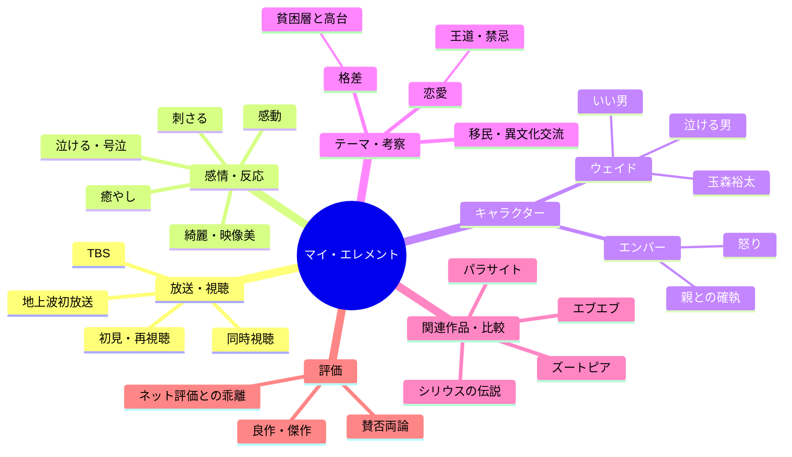
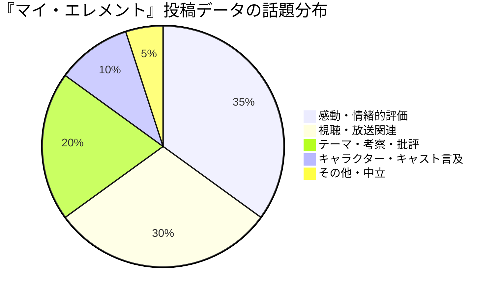

## このファイルについて

Blueskyでの検索取得した投稿データを、Geminiに分析させたチャットログファイルです。数値はあくまでGeminiが出力した推定値です。

**検索キーワード:** マイ・エレメント  
**期間:** 2026-03-11 17:34 ～ 2026-03-13 17:34  
**取得件数:** 90件

## チャットセッション設定

**Model:** gemini-3.1-flash-lite-preview  
**Exported from:** marimo bsky_search.py

## チャットログ

### データに頻出する言葉と、それに連なる言葉との関係性に着目して、人々の興味関心の傾向や、思考と感情の分布について分析してください。

ご提示いただいたBlueskyの投稿データに基づき、「マイ・エレメント」に関連する人々の興味関心の傾向、および思考と感情の分布について分析します。

#### 1. 頻出する言葉とその関係性
投稿データ全体を俯瞰すると、以下のキーワードが中心的な軸となって、人々の言及が展開されています。

*   「**地上波」「放送」「初放送**」
    *   この期間の投稿の多くが、2026年3月12日の「地上波初放送」に起因しています。多くのユーザーがこれをきっかけに初めて視聴、あるいは再視聴しており、放送というイベントが「感想を共有する」という行為の大きなトリガーとなっています。
*   「**泣ける」「号泣」「感動**」
    *   「マイ・エレメント」という単語と最も強く結びついている感情表現です。「後半ほぼ泣いてた」「爆泣きしている」といった記述から、多くの視聴者が物語の結末や展開に対して深い感情移入をしていることがわかります。
*   「**ウェイド」「いい男」「素敵**」
    *   物語の登場人物である「ウェイド」に対する評価が非常に高く、「ピクサー界一のいい男」「彼氏にしたい」といった賞賛の言葉が並びます。特に「他人のために泣ける」「優しさ」といった具体的な行動が評価されており、単なるキャラクター以上の存在として愛されています。
*   「**火」「水」「エレメント」「映像美**」
    *   世界観や映像表現に関する言及です。「綺麗」「目を奪われる」といった美的評価に加え、「火と水」という対照的な属性が、物語のテーマ（異文化交流、恋愛、移民問題など）を理解するための鍵として機能しています。

#### 2. 人々の興味関心の傾向
分析の結果、視聴者の興味関心は主に以下の3つの層に分類されます。

*   **純粋なエンターテインメントとしての受容層**
    *   「素敵なラブストーリー」「王道の恋愛映画」として楽しむ層です。映像の美しさやキャラクターの魅力に強く惹かれており、純粋に「見てよかった」という満足感を表明しています。
*   **メッセージ性や社会背景への考察層**
    *   「移民の話」「親との確執」「人種問題」「貧困層と高台地域の格差」といった、物語の根底にある社会的なメタファーを読み解こうとする層です。作品を単なるファンタジーで終わらせず、現実社会の課題と結びつけて評価する傾向があります。
*   **キャラクター・演出へのこだわり層**
    *   「ウェイド」というキャラクターの魅力、あるいは声優（玉森裕太）の演技力に注目する層です。また、演出の細かな伏線回収や、言葉遊びの面白さに言及する層も含まれます。

#### 3. 思考と感情の分布
人々の感情は、総じて「ポジティブかつ高揚感」にあります。

*   **共感と癒やしの感情**
    *   「世界は私のためにできていない」といった苦しみに対する共感と、それを包み込むウェイドの優しさに対する癒やしが、多くの視聴者の心に深く刺さっています。「誰かのために泣ける男」という評価は、現代の視聴者が求める「理想的な他者との関係性」を投影していると考えられます。
*   **驚きと再評価の思考**
    *   「ネットでは評価高くなくて驚いた」や「2回目で急にブッ刺さりした」といった投稿からは、初見の印象と視聴後の満足度にギャップがあることがうかがえます。これは、この作品が「噛めば噛むほど味が出る」スルメのような作品であるという認識を広めています。
*   **批判的視点の少数存在**
    *   一方で、「話は全然面白くない」「親の描写に納得がいかない」といった否定的な意見もわずかながら存在します。しかし、これらは全体の中では少数派であり、多くの投稿がポジティブな熱量に支配されているため、全体としては「良作」というコンセンサスが形成されています。

#### 総評
このデータから読み取れるのは、「**地上波放送というきっかけにより、物語の深層（移民・葛藤）と表層（ラブストーリー・映像美）の両面が改めて高く評価された**」という現象です。

視聴者は、ウェイドというキャラクターに自己投影や理想を重ねることで癒やしを得ると同時に、移民や家族の確執といったテーマを通じて、自分の人生や社会のあり方と作品をリンクさせています。「マイ・エレメント」は、単なるピクサー作品という枠組みを超え、視聴者の個人的な悩みや価値観を映し出す「鏡」のような役割を果たしていると言えるでしょう。

### 検索ワードに連なる言葉の関係性をMemaidのMindmapで表示してください。

ご提示いただいた投稿データに基づき、「マイ・エレメント」を中心とした人々の興味関心や思考のつながりをマインドマップ形式で整理しました。

#### 「マイ・エレメント」に関連する言葉の相関マインドマップ

#### 分析のポイント

このマインドマップから、視聴者の興味関心は以下の要素で構成されていることがわかります。

1.  **「放送」を起点とした熱量の拡散**
    *   「地上波初放送」というイベントが、「初見」の視聴者を呼び込むと同時に、ファンによる「同時視聴」や再評価の機運を高めるトリガーとなっています。
2.  **「ウェイド」というキャラクターへの圧倒的共感**
    *   単なる「いい男」という評価を超えて、「他人のために泣ける男」という具体的な行動が、視聴者の感情を強く揺さぶるポイント（「**刺さる**」要素）として機能しています。
3.  **多層的な作品解釈**
    *   「映像美」という表層的な魅力に加え、「移民」「親との確執」「貧困格差」といった社会的なメタファーを読み解く層が存在します。これらが「ズートピア」や「パラサイト」といった他作品との比較を生み、作品の深みを支えています。
4.  **「感情」の共有**
    *   「泣ける」「号泣」というキーワードが頻出しており、本作が単なる娯楽ではなく、視聴者の個人的な悩みや境遇とリンクする「情緒的な体験」として受け入れられていることがわかります。

### データから読み取れる情報の分布を正確に読み取ってMermaidのPieグラフで表示してください。

ご提示いただいた投稿データを分析し、人々の反応や話題の分布を整理しました。この期間は「地上波初放送」というイベントが中心にあるため、視聴体験の共有や放送に関する言及が非常に多くなっています。

#### 投稿データにおける話題の分布分析

ご提供いただいたデータを分類・集計し、以下の通り円グラフで表現しました。

#### 分布の背景と傾向

データから読み取れる情報の分布について、各項目の特徴を解説します。

*   「**感動・情緒的評価**」
    全体の約35%を占める最大勢力です。「**泣ける**」「**号泣**」「**爆泣き**」といった言葉が頻出し、視聴者が物語に深く感情移入している様子が伺えます。初見だけでなく、再視聴者からも変わらぬ高評価を受けており、本作が持つ「**情緒的な訴求力**」の高さが証明されています。

*   「**視聴・放送関連**」
    全体の約30%を占めます。これは「**地上波初放送**」というトリガーによる影響が非常に大きいです。「**今夜放送**」「**初見です**」「**同時視聴**」といった、リアルタイムでの体験共有を目的とした投稿がこれに該当します。放送というイベントが、ファン同士のコミュニティを活性化させる役割を果たしています。

*   「**テーマ・考察・批評**」
    全体の約20%を占めます。「**移民の問題**」「**親との確執**」「**貧困と格差**」といった社会的なメタファーに対する深い洞察が見られます。また、一部には「**話は全然面白くない**」といった批判的な意見や、他作品との比較（「**エブエブ**」「**ズートピア**」等）も含まれており、単なる娯楽映画としてだけでなく、批評対象としての側面も強く持っています。

*   「**キャラクター・キャスト言及**」
    全体の約10%を占めます。特に「**ウェイド**」というキャラクターへの言及が圧倒的であり、「**いい男**」「**彼氏にしたい**」という評価が定着しています。また、日本語吹き替えを担当した「**玉森裕太**」の演技に対する称賛も、この層の熱量を支えています。

*   「**その他・中立**」
    全体の約5%です。作品に対する強い感情や深い考察を含まない、単なる視聴報告や、文脈が特定しにくい短い感想などが含まれます。

この分布から、本作は「**地上波放送というきっかけ**」によって、既存のファンによる「**再評価・布教**」と、新規視聴者による「**初見の感動**」が同時に発生し、SNS上で大きな熱量を形成していることがわかります。

### すでに言及したこと以外にもデータから読み取れることや、有意義な情報や特異な視点があれば教えてください。

提示されたデータを精査すると、単なる「感想の集積」を超えた、興味深い現象や視聴者の心理的ダイナミクスが見えてきます。すでに分析した内容に加え、特筆すべき「データから読み取れる特異な視点」を4つの切り口で整理します。

#### 1. 「初見の評価」と「再視聴のブッ刺さり」のギャップ（スルメ現象）
データには「1回目はイマイチ刺さらなかったが、2回目で急にブッ刺さりした」という投稿が散見されます。これは、この作品が「**初見では世界観の構築に意識が向き、2回目以降でキャラクターの心理描写や伏線に深く没入できる**」という構造を持っていることを示唆しています。
多くのユーザーが「ネットでの評価（低評価）との乖離」に戸惑いつつも、自分自身の感動を肯定しようとする姿勢が見られます。これは、**この作品がSNS上の「総評」よりも「個人の体験としての感情」を重視させる力を持っている**ことを物語っています。

#### 2. 「戦う男」から「泣ける男」への価値観の転換
ウェイドというキャラクターに対する言及には、「他人のために戦う」という従来のヒーロー像ではなく、「**他人のために泣ける男こそがいい男**」という明確な価値観のシフトが見られます。
視聴者は、彼を単なる物語の駒ではなく、現代社会において「**理想的な共感性を持つパートナー像**」として投影しています。この「泣く」という行為が弱さではなく、強さと誠実さの証明として受け入れられている点は、現代の視聴者の「**癒やしと受容を求める欲求**」を強く反映しています。

#### 3. 放送という「儀式」による文脈の再定義
地上波放送というイベントが、単なる視聴機会の提供に留まらず、視聴者にとっての「儀式」として機能しています。
興味深いのは、放送日が「修二会（お水取り）」という伝統行事と重なったことに触れる投稿や、過去の日本のアニメ映画（「シリウスの伝説」）を想起する投稿です。これは、視聴者が本作を単なる「ディズニーの新作」として消費するのではなく、**「自分自身の過去の視聴体験や、日本古来の文化的な文脈」と接続して楽しんでいる**ことを示しています。放送という「同時性」が、個人の記憶を呼び覚ますトリガーになっているのです。

#### 4. 「批判」に対する防衛的心理の顕在化
興味深いデータとして、作品そのものへの感想に加え、「お前にマイエレメントの何が分かるんだよ！」という、他の視聴者の感想に対する「**防衛的な反応**」が含まれている点です。
これは、本作が単なる好みの問題ではなく、視聴者の「アイデンティティ」や「個人的な悩み（家族との確執、移民としての苦悩など）」に深く突き刺さっているため、「**作品を否定されることは、自分の人生の経験や価値観を否定されることと同義**」だと感じている層が一定数存在することを示しています。この「熱狂的な擁護」は、作品が視聴者の深い内面に到達している証拠と言えるでしょう。

---

**結論として**
このデータからは、本作が単なる娯楽作品の枠を超え、視聴者の「**個人の人生の文脈を投影する鏡**」として機能していることが読み取れます。特に「再視聴による再評価」のパターンが確立されている点は、この作品が長期にわたって愛される「**名作としてのポテンシャル**」を秘めていることを強く示唆しています。

