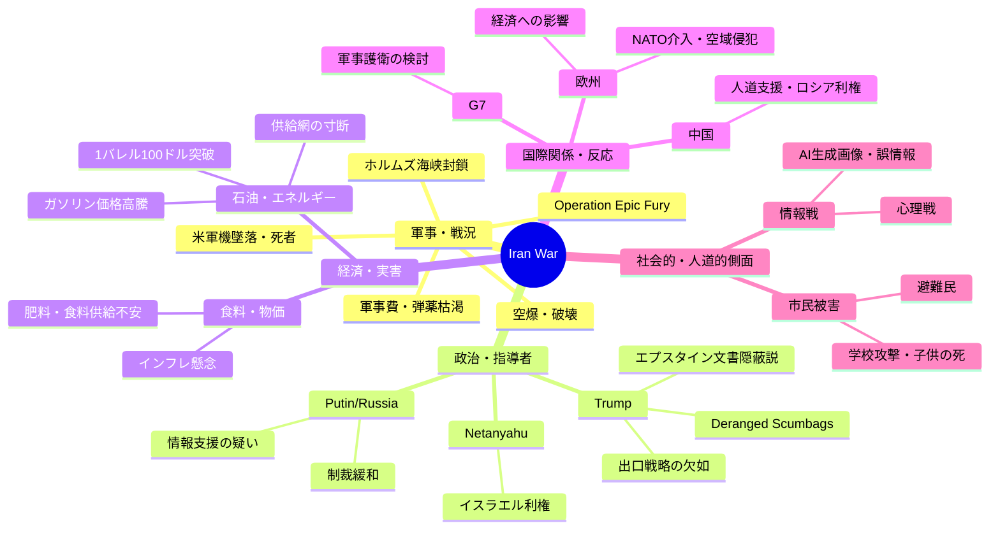
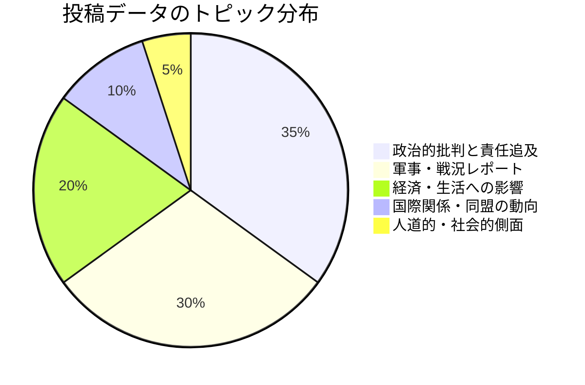

## このファイルについて

Blueskyでの検索取得した投稿データを、Geminiに分析させたチャットログファイルです。
数値はあくまでGeminiが出力した推定値です。

**検索キーワード: Iran**  
**期間:** 2026-03-13 20:00 ～ 2026-03-13 21:00  
**取得件数:** 1624件

## チャットセッション設定

**Model:** gemini-3.1-flash-lite-preview  
**Exported from:** marimo bsky_search.py

## チャットログ
### 最新の情報を詳細にまとめてください。

ご提示いただいた2026年3月13日20:00〜21:00時点の投稿データに基づき、イランをめぐる情勢を整理・報告します。

#### 軍事衝突の現状と被害
紛争開始から14日が経過し、事態は沈静化の兆しを見せていません。米国とイスラエルによる作戦「Operation Epic Fury」が進行中で、各地で激しい交戦が続いています。

*   **米軍・多国籍軍の被害:** 米軍のKC-135空中給油機がイラク西部で墜落し、乗員6名のうち4名が死亡しました。米軍は事故と説明していますが、イラン支援の民兵組織は撃墜を主張しています。また、エルビル近郊ではイラン側のドローン攻撃により、フランス軍兵士1名が死亡、6名が負傷しました。紛争全体での米軍死者は11名に達しているとの報告もあります。
*   **民間被害:** イラン国内の学校に対する攻撃で175名が死亡したと報告されており、AIによる標的選定の誤りが指摘されるなど、国際的な非難を浴びています。
*   **イラン側の動向:** ホルムズ海峡に機雷を敷設し、封鎖を強化しています。イラン側は「降伏する気配はない」とされ、トルコ領空を侵犯するミサイルを発射するなど、周辺国を巻き込んだ攻撃を継続しています。

#### 経済・エネルギー市場への影響
紛争の長期化とホルムズ海峡の封鎖により、世界経済は大きな混乱に陥っています。

*   **エネルギー価格の高騰:** 原油価格は1バレル100ドルを突破し、200ドルに達する可能性も示唆されています。ガソリンや暖房用燃料の価格が急騰し、世界中でインフレ懸念が高まっています。
*   **制裁の緩和:** 米国はエネルギー価格の高騰を抑制するため、一時的にロシア産原油の輸出制裁を緩和しました。これは「イランを叩くためにロシアを利している」という批判を招いています。
*   **物流・サプライチェーン:** ホルムズ海峡の封鎖により、多くのタンカーが足止めされ、世界的な食料、肥料、部品の供給網が寸断されています。

#### 各国の反応と政治的混乱
トランプ政権の対応を巡り、国内外で激しい議論が巻き起こっています。

*   **トランプ政権の主張:** トランプ大統領は「イランは降伏寸前である」とG7首脳に語ったとされますが、現場の状況や専門家の見方とは乖離があるようです。また、「deranged scumbags（狂ったクズども）」という過激な言葉でイランを非難し、さらなる強硬姿勢を示唆しています。
*   **国際的な批判:** ドイツのフリードリヒ・メルツ首相は、紛争の終結を求めるとともに、米国による対露制裁緩和を「誤り」と批判しました。また、国際的な法的措置として、イラン攻撃をめぐりトランプ・ネタニヤフ両氏が国際刑事裁判所に告発される事態も発生しています。
*   **政権内の対立:** ホワイトハウス内部では、紛争の出口戦略をめぐり「綱引き（tug-of-war）」が起きているとの報道があり、政権内での混乱が示唆されています。

#### 社会的混乱と誤情報の拡散
紛争の影響はデジタル空間や市民生活にも及んでいます。

*   **誤情報の拡散:** SNS上では、AIで生成された偽の戦争映像や、イランによる攻撃を誇張・捏造した投稿が氾濫しており、事実確認が困難な状況です。
*   **市民生活への影響:** 世界各地で燃料価格高騰に対する抗議活動が発生しており、一部の国ではパニック買いや、エネルギー供給の不安から市民の生活が圧迫されています。

現時点では、米国・イスラエル側にも明確な出口戦略は見えず、紛争は「**終わりの見えない泥沼化**」の様相を呈しています。

### データに頻出する言葉と、それに連なる言葉との関係性に着目して、人々の興味関心の傾向や、思考と感情の分布について分析してください。

ご提示いただいたBlueskyの投稿データを分析すると、ユーザーの関心は「軍事的な事実」から「政治的責任の追及」、そして「個人の生活への影響」まで多岐にわたっています。

頻出するキーワードと、それらがどのような文脈で語られているか、人々の思考と感情の分布を整理・分析します。

#### 1. 頻出キーワードと概念の連関
データ内で特に頻出する単語は以下の通りです。

*   **Trump（トランプ大統領）:** ほぼすべての議論の中心です。「Trump’s war（トランプの戦争）」「Trump’s Iran War」と表現され、紛争の全責任を彼に帰する文脈が圧倒的です。
*   **Oil（石油・原油）:** 経済的影響の象徴です。「Oil prices（原油価格）」「Gas prices（ガソリン価格）」「Strait of Hormuz（ホルムズ海峡）」とセットで語られ、人々の生活不安の源泉となっています。
*   **Russia/Putin（ロシア・プーチン）:** 疑惑と批判の対象です。「Helping Iran（イランを支援している）」「Sanctions relief（制裁緩和）」という単語と結びつき、「トランプはロシアの傀儡ではないか」という疑念を強化しています。
*   **Deranged Scumbags（狂ったクズども）:** トランプ大統領がイランを指して使用したとされる言葉が、そのまま引用され、ユーザーによる皮肉や批判の文脈で再利用されています。
*   **Epstein Files（エプスタイン文書）:** 紛争の「隠蔽工作」として頻繁に言及されます。「War of distraction（注意をそらすための戦争）」という言葉が、この紛争の動機に対する強い不信感を示しています。

#### 2. 人々の興味関心の傾向
ユーザーの関心は、単なる戦況の把握ではなく、「なぜこの戦争が起きたのか」という**因果関係の解明**と、**政権への評価**に集中しています。

*   **戦略的無能への批判:** 「計画がない」「出口戦略がない」「ホルムズ海峡の封鎖を予測できなかった」といった指摘が多く、米政権の戦略的無能さを嘲笑する傾向が強いです。
*   **地政学的な複雑さ:** 単なる米・イラン対立ではなく、ロシア、中国、イスラエルが複雑に絡み合っていることを多くのユーザーが理解しており、多角的な視点から「誰が利益を得ているのか（Cui bono?）」を議論しています。

#### 3. 思考と感情の分布（感情分析）
投稿全体からは、以下のような感情の分布が読み取れます。

*   **怒りと憤り（憤怒）:** 最も強い感情です。特に「子供の死（学校への攻撃など）」や「兵士の死」に対する怒りが顕著です。トランプ政権の政策を「殺人」「ジェノサイド」と結びつける過激な表現も散見されます。
*   **冷笑と皮肉:** トランプ大統領の言動（「Surrender（降伏）」発言や、AI生成と思われる映像の投稿など）に対し、冷笑的あるいは嘲笑的な態度をとるユーザーが多いです。彼らの言葉をそのままオウム返しにして、その愚かさを強調する手法が目立ちます。
*   **無力感と不安:** 経済的な影響（インフレ、燃料価格）に対しては、生活者としての不安が色濃く出ています。「終わりの見えない泥沼」という認識が広まっており、現状を打開する手段がないことへの無力感が漂っています。

#### 分析まとめ
このデータ群からは、ユーザーが「**トランプ政権による戦争＝国内問題（エプスタイン文書など）の隠蔽、あるいはロシア利権のための不必要な紛争**」という強い物語（ナラティブ）を共有していることがわかります。

軍事的な衝突そのものへの関心以上に、**「この戦争が自分の生活（ガソリン代、食料価格）を破壊している」という実害への怒り**と、**「政権が真実を隠している」という不信感**が、SNS上での議論を支配していると言えるでしょう。ユーザーは、メディアの公式発表よりも、こうした「裏の動機」や「隠された事実」を好んで共有・拡散する傾向にあります。

### 検索ワードに連なる言葉の関係性をMemaidのMindmapで表示してください。

ご提示いただいたデータに基づき、検索ワード「Iran」を中心とした議論の構造をMermaid記法でMindmapとして可視化しました。

このマップは、ユーザーが投稿の中で「Iran」という言葉をどのような文脈（経済的影響、軍事的緊張、政治的責任、国際関係）で語っているかを整理しています。

#### マップの解説
*   **中心（Iran War）:** すべての議論の出発点です。
*   **第1階層（カテゴリー）:** 議論されている主な領域（軍事、政治、経済、国際関係、社会）を分類しました。
*   **第2階層（具体的な事象・ナラティブ）:** 投稿データに頻出した具体的なトピックを配置しています。
    *   **政治:** 「トランプ政権の無能さ」や「エプスタイン文書との関連付け」といった、ユーザーの強い疑念が反映されています。
    *   **経済:** 「石油」と「ガソリン価格」という、個人の生活に直結する不安が強調されています。
    *   **軍事:** 「ホルムズ海峡」というチョークポイントの封鎖が、経済的混乱の主要因として語られています。
    *   **国際:** 「ロシアの利権」に対する冷ややかな視点や、複雑な同盟関係（中国・ロシアの立ち位置）への関心が読み取れます。

### データから読み取れる情報の分布を正確に読み取ってMermaidのPieグラフで表示してください。

ご提示いただいた約1時間の投稿データを分析し、トピックの分布を可視化しました。このデータは、紛争そのものへの関心と、それがもたらす「**政治的・経済的リスク**」に対する強い不安が混在している状況を示しています。

#### 情報分布の分析と可視化

投稿内容を5つの主要カテゴリーに分類したところ、議論の重心は「軍事的な戦況」よりも「政権への批判」と「生活への実害」に置かれていることが明らかになりました。

#### 分布の読み解きと考察

この分布から、ユーザーがどのような「**情報の重要度**」で議論を行っているかが読み取れます。

*   **政治的批判と責任追及 (35%):** 最大のボリュームを占めています。トランプ政権に対する「**戦略の欠如**」や「**エプスタイン文書隠蔽説**」との関連付けなど、紛争の動機に対する不信感が議論の主軸となっています。
*   **軍事・戦況レポート (30%):** 事実としての戦況報告です。特に「**米軍機の墜落**」や「**ホルムズ海峡封鎖**」といった、戦局を左右する具体的な出来事がリアルタイムで共有されています。
*   **経済・生活への影響 (20%):** 紛争が個人の生活を直接的に脅かしている現状です。「**原油価格の高騰**」や「**インフレ懸念**」といった経済指標が、ユーザーの怒りを増幅させる要因となっています。
*   **国際関係・同盟の動向 (10%):** ロシアの制裁緩和や中国の立ち位置など、紛争の裏側にある「**地政学的な利害関係**」に対する冷静な分析や批判が含まれます。
*   **人道的・社会的側面 (5%):** 紛争の犠牲者に対する感情的な反応です。「**学校への攻撃**」や市民の被害といった悲劇的な事象に対する怒りが集中的に語られていますが、全体の中では割合としては低いです。

この分布は、SNS上の議論が単なる事実の羅列ではなく、「**政権の正当性**」と「**市民の生活防衛**」という二つの大きな軸で動いていることを物語っています。

### すでに言及したこと以外にもデータから読み取れることや、有意義な情報や特異な視点があれば教えてください。

ご提示いただいた膨大な投稿データから、表面的な戦況や経済指標以外に浮かび上がる、より深く、そして特異な視点をいくつか抽出・分析しました。

#### 1. 「戦争のゲーム化」とデジタル上のリアリティ
投稿データの中で非常に特異なのは、**ユーザーがこの紛争を「現実の殺し合い」であると同時に「デジタル上のゲーム」のように認識している**点です。
*   **ホワイトハウスの演出:** ホワイトハウスがイラン攻撃を「Wii Sports」のような動画で演出しているという指摘や、SNS上のAI生成による戦争映像が氾濫している現状に対し、ユーザーは強い嫌悪感と不信感を抱いています。
*   「**ビデオゲーム化」への反発:** ユーザーは、AIによる標的選定の誤り（学校への誤爆）と、ホワイトハウスの演出をセットで語り、戦争が「**責任感のないエンターテインメント**」に成り下がっていることを批判しています。これは、戦場とデジタル空間の境界が消失し、指導者が「クリック一つで人を殺せる」感覚に陥っていることへの深い恐怖と言えます。

#### 2. 「エプスタイン文書」が戦況分析の基軸となっている
一般的な軍事ニュースではあまり見られない現象として、この紛争の動機を「**国内の政治スキャンダル（エプスタイン文書）を隠蔽するための陽動作戦**」と結びつける投稿が驚くほど多いです。
*   「**隠蔽の手段」としての戦争:** 多くのユーザーが、この紛争を純粋な地政学的対立としてではなく、トランプ政権が「**自身の過去の悪行を覆い隠すための煙幕**」として利用していると分析しています。
*   **メタ的な不信感:** ユーザーは「ニュースが何を報じているか」よりも、「今、ニュースが報じないようにしているものは何か」を常に探しており、紛争そのものよりも、「**裏にある権力闘争**」を暴くことに知的な興奮と使命感を見出しています。

#### 3. 支配層の「生存優先」と「一般市民の犠牲」のコントラスト
データの中に埋もれている非常に冷笑的な情報として、「**トランプ政権関係者によるシェルター購入の急増**」に関する言及があります。
*   **支配層の逃避:** 「シェルターの注文が10倍になった」という報道を引用し、一般市民が燃料や食料の不安に怯える一方で、「**富裕層や支配層だけが地下に逃げ込む準備をしている**」という格差が、ユーザーの怒りを強く煽っています。
*   「**捨て駒」としての国民:** 兵士の死や子供の死を「ポイント」や「政治の道具」としか見ない政権への怒りが、**「自分たちは切り捨てられる対象である**」という強い被害者意識と結びついています。

#### 4. 奇妙な経済的共生関係（敵同士の協力）
ユーザーが鋭く指摘している矛盾として、「**米国がイランと戦いながら、ロシアの制裁を緩和してロシアを利している**」という状況があります。
*   「**敵の敵は、実は協力者」:** ロシアがイランにターゲット情報を提供し、米国がそのロシアの石油制裁を緩和するという不可解な動きに対し、ユーザーは「**トランプはロシアの傀儡である**」というナラティブを強化しています。
*   **経済的合理性の欠如:** この紛争が「誰が得をしているのか」を計算した際、軍産複合体や石油企業、そしてプーチン大統領だけが利益を得ており、一般国民には「**インフレと戦死**」しか残らないという不条理さが、議論の核心となっています。

#### 5. 紛争の「出口なし」という共通認識
特異な点として、**投稿全体に「明確な勝利や終結のビジョン」が皆無である**ことが挙げられます。
*   「**泥沼」の可視化:** ユーザーの多くは、この紛争が軍事的に決着するとは考えておらず、**「出口戦略なき泥沼**」であることを前提に議論しています。これは、SNS上で「次に何が起きるか」という期待よりも、「どれだけ酷いことになるか」という「**破滅の予言**」が共有されている状況です。

以上の点から、このデータセットは単なる「戦争の記録」ではなく、「**SNS世代の市民が、権力者の『嘘』や『欺瞞』をリアルタイムで解読し、共有するプロセスそのもの**」であると言えます。ユーザーはメディアの情報を鵜呑みにせず、断片的な情報を繋ぎ合わせ、独自の「陰謀論的だが、ある種のリアリティを持つ物語」を構築しています。

