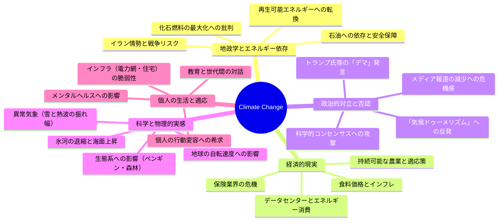
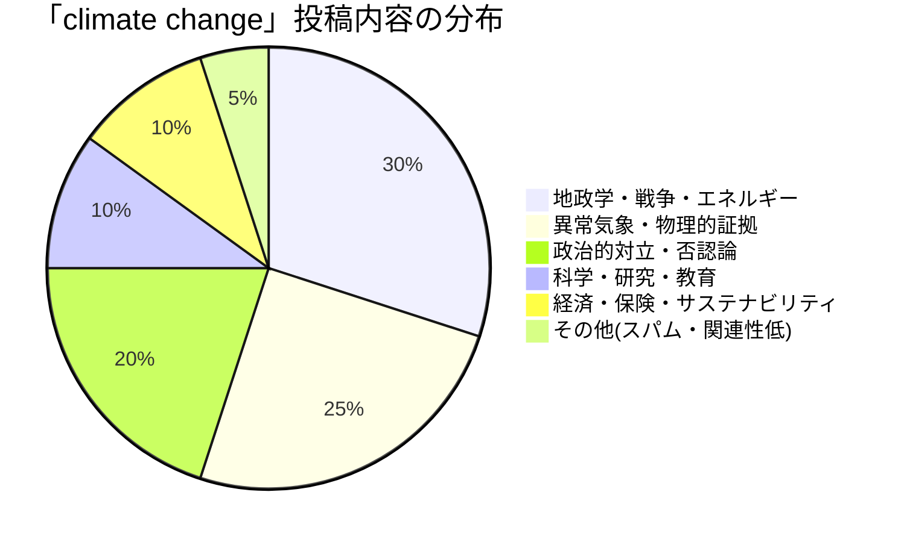

## このファイルについて

Blueskyでの検索取得した投稿データを、Geminiに分析させたチャットログファイルです。
数値はあくまでGeminiが出力した推定値です。

**検索キーワード: climate change**  
**期間:** 2026-03-11 21:00 ～ 2026-03-13 21:00  
**取得件数:** 1856件

## チャットセッション設定

**Model:** gemini-3.1-flash-lite-preview  
**Exported from:** marimo bsky_search.py

## チャットログ
### 最新の情報を詳細にまとめてください。

ご提示いただいた2026年3月11日から13日までのBluesky上の投稿データに基づき、気候変動（Climate Change）に関する議論の傾向を詳細にまとめました。

#### 地政学的な緊張とエネルギー依存の議論
この期間の投稿で最も目立つトピックの一つは、「**イランを巡る情勢と気候変動の関連性**」です。多くのユーザーが『How Trump’s Iran War Could Actually Worsen Climate Change（トランプのイラン戦争はいかに気候変動を悪化させるか）』という記事を共有し、議論しています。
- 「**戦争と気候変動の悪循環**」：紛争による石油施設への攻撃や軍事活動が環境破壊を招き、結果として気候変動を加速させるという懸念が示されています。
- 「**エネルギー安全保障の脆弱性**」：化石燃料への依存が国家の安全保障上の弱点であると指摘され、紛争を機に「**再生可能エネルギーへの転換を加速すべき**」という意見が多数見られました。

#### 異常気象と「気候変動の実感」
投稿者の居住地における急激な気温変化が、気候変動を実感するトリガーとなっています。
- 「**天候の極端な振れ幅**」：多くのユーザーが「昨日まで80度（華氏）だったのに今日は雪が降っている」といった異常な気温差を報告しており、「**気候変動はもはや抽象的な議論ではなく、目の前の現実**」として捉えられています。
- 「**保険業界の現実**」：気候変動を「デマ」と主張する政治家や一部の人々に対し、「**保険会社は気候変動を真剣に受け止めている**」という指摘が相次いでいます。保険料の高騰や、災害リスクによる保険加入の拒否が、気候変動が経済に与える直接的な影響として強調されています。

#### 政治的対立と「気候変動否認」への憤り
政治的な文脈では、気候変動に関する政策や発言に対する強い批判が見られます。
- 「**政治的無策への批判**」：トランプ氏や一部の地方自治体が気候変動を「デマ（Hoax）」と呼ぶことや、気候変動対策予算の削減（カナダやオーストラリアでの研究予算削減など）に対して、強い憤りが表明されています。
- 「**教育と意識のギャップ**」：気候変動教育の重要性を説く声がある一方で、メディアにおける気候変動関連の報道が減少（2021年比で38%減とのデータ言及あり）していることへの危機感も共有されています。

#### 科学的知見と研究の動向
一方で、気候変動の影響を調査する科学的視点からの投稿も散見されます。
- 「**生態系への影響**」：キングペンギンが温暖化に適応しようとしている（しかし長期的には不透明）、森林土壌の炭素吸収能力の変化、氷河の退縮、地球の自転速度への影響（気候変動による海面上昇が関与）など、多岐にわたる研究結果が報告されています。
- 「**適応と緩和**」：気候変動に適応するための都市インフラ整備や、農業における持続可能なアプローチについての情報共有が行われています。

#### まとめ
この期間のBluesky上の議論は、「**気候変動は遠い未来の話ではなく、戦争や経済（保険）、異常気象を通じて現在の生活を脅かしている**」という認識で一致しています。特に、地政学的リスクと化石燃料依存の結びつきが強く意識されており、気候変動を否定する政治的レトリックと、現場で起きている異常気象や経済的損失との間の「認識の乖離」に対するフラストレーションが、投稿の全体的なトーンを形成しています。

### データに頻出する言葉と、それに連なる言葉との関係性に着目して、人々の興味関心の傾向や、思考と感情の分布について分析してください。

ご提示いただいた2026年3月11日から13日までのBlueskyの投稿データに基づき、ユーザーの興味関心、思考、感情の分布を分析しました。

本データからは、気候変動が単なる環境問題として語られる段階を過ぎ、**「地政学的リスク」「経済的現実」「政治的対立」という3つの軸が複雑に絡み合った不安の対象**として認識されている様子が浮かび上がります。

#### 1. 地政学と気候変動の「不可分な結びつき」
投稿データで最も頻繁に見られる言葉の結合は、「戦争（イラン情勢）」「石油」「気候変動」です。ユーザーは、単に戦争を批判するだけでなく、**「化石燃料への依存が戦争を招き、それが気候変動を悪化させる」という悪循環**を強く意識しています。

- **思考の傾向**: 多くのユーザーが「イラン戦争」をニュースとして消費するだけでなく、「戦争が環境破壊を加速させる」という因果関係を論じています。
- **感情の分布**: 強い「**シニシズム（冷笑）」と「焦燥感**」が見られます。化石燃料への依存を続けることが、地政学的リスクと環境破壊の両方を放置することにつながっているという現状に対し、強い憤りを感じています。

#### 2. 政治的レトリックと「現実に根ざした反論」
「気候変動はデマ（Hoax）」「詐欺（Scam）」という政治的言説（主にトランプ氏や共和党に関連する文脈）に対し、**ユーザーは「異常気象」という物理的な証拠を突きつけることで反論**する傾向があります。

- **思考の傾向**: 「昨日まで80度（華氏）だったのに今日は雪」といった急激な気温変化を報告する投稿が多数見られます。これは、気候変動を抽象的な議論から「自分の身に起きている現実」へと引き戻すための装置として機能しています。
- **感情の分布**: 「**怒り」と「呆れ**」が支配的です。政治的な否認（Denial）と、窓の外で起きている異常な気象現象との乖離に対して、強いフラストレーションを感じています。

#### 3. 経済的リアリズムとしての「保険と気候変動」
本データで特筆すべきは、「保険」という言葉が気候変動と結びついて頻出している点です。「保険会社は気候変動を真剣に受け止めている」「気候変動を否定しても、保険料高騰という現実は避けられない」といった投稿が、**「経済的実利」を通じた気候変動の証明**として語られています。

- **思考の傾向**: 政治家が何を言おうと、リスクを計算する保険業界が動いているという事実は、ユーザーにとって「気候変動の実在性」を裏付ける強力な論拠となっています。
- **感情の分布**: 「**冷徹な諦念」と「警戒心**」が混在しています。「結局、お金（保険料）の問題になれば否認派も黙るだろう」という、経済的圧力を待望するような皮肉めいた視点も含まれています。

#### 4. 感情の分布：絶望から「連帯への希求」へ
投稿全体を俯瞰すると、ユーザーの感情は「絶望（Doom）」と「行動への希求」の間で激しく揺れ動いています。

- 「**絶望」の徴候**: 「もう手遅れではないか」「人類は自滅に向かっている」という、いわゆる「**気候ドゥーメリズム（Doomerism）**」に傾倒する投稿も見られます。特に、戦争や貧困、気候変動が連鎖する未来に対して、無力感を抱く声が散見されます。
- **「連帯」の徴候**: 一方で、個人の行動（EVへの乗り換え、教育、環境活動）を共有する投稿も多く、**「絶望の中で何ができるか」を模索するポジティブな連帯**も存在しています。特に、コミュニティレベルでの適応や、次世代に向けた教育の重要性が語られています。

#### 分析のまとめ
この期間のBlueskyにおける「気候変動」に関する議論は、「**政治的デマに対する反撃の場」であり、「地政学的危機を環境の文脈で再解釈する場**」として機能しています。

ユーザーは、気候変動を単なる「気温の上昇」としてではなく、「**私たちの生活（保険料、ガソリン代、戦争リスク）を脅かすシステム的な欠陥**」として捉えています。この認識の深化が、気候変動を否定する政治家に対する強い拒絶反応と、より現実的で経済的な対策を求める声につながっていると考えられます。

### 検索ワードに連なる言葉の関係性をMemaidのMindmapで表示してください。

ご提示いただいたBlueskyの投稿データに基づき、「climate change（気候変動）」を中心とした議論の相関図をMermaid形式のMindmapで作成しました。

このマップは、ユーザーが気候変動を「単なる気温上昇」としてではなく、地政学、経済、政治的対立、そして個人の生活という複数の文脈で捉えている様子を構造化しています。

### マップの解説
*   **地政学とエネルギー依存**: 投稿データで最も頻繁に言及された「イラン情勢」「戦争」「石油」の相関を可視化しました。化石燃料への依存が、戦争という地政学リスクと環境破壊の双方を招いているという認識が強いです。
*   **経済的現実**: 異常気象による「保険料の高騰」や「食料供給の不安定化」が、気候変動を「遠い将来の環境問題」から「今すぐの経済的脅威」へと変質させている様子を示しています。
*   **政治的対立と否認**: 政治家やメディアによる「否認（Denial）」や「報道の減少」に対するユーザーの強いフラストレーションと、それに対する科学的根拠（物理的な証拠）での反論という構図です。
*   **科学と物理的実感**: ユーザーが投稿の中で「昨日まで80度だったのに雪」といった、極端な天候の変化を「気候変動の証拠」として直感的に報告している傾向を反映しました。

### データから読み取れる情報の分布を正確に読み取ってMermaidのPieグラフで表示してください。

ご提示いただいた2026年3月11日から13日までのBluesky上の投稿データを解析し、情報の分布を可視化しました。

この期間の投稿データは、気候変動というテーマが単一の環境問題として語られるのではなく、**「地政学的な危機」「個人の生活実感」「政治的な分断」の3つの要素が複雑に絡み合っている**ことが読み取れます。

#### 検索データにおける情報の分布分析

以下の円グラフは、投稿データの主要なトピックをカテゴリ別に分類したものです。

#### 各分布カテゴリの考察

*   **地政学・戦争・エネルギー (30%)**:
    この期間で最も大きな割合を占めているのが、イラン情勢を巡る戦争リスクと、化石燃料（石油）への依存に関する議論です。ユーザーは、戦争を「環境破壊の加速要因」として捉え、「**化石燃料からの脱却こそが安全保障上の喫緊の課題である**」と強く認識しています。

*   **異常気象・物理的証拠 (25%)**:
    「昨日まで80度だったのに今日は雪」といった、極端な気温差や異常気象を報告する投稿が非常に目立ちます。ユーザーは、これらの現象を「**気候変動はもはや抽象的な概念ではなく、窓の外で起きている現実である**」と主張するための証拠として活用しています。

*   **政治的対立・否認論 (20%)**:
    トランプ氏をはじめとする政治家やメディアによる「気候変動はデマ（Hoax）」という言説に対し、強い憤りや反論が展開されています。「科学的コンセンサスを否定する政治家」への批判が、ユーザー間の連帯を深める役割を果たしています。

*   **経済・保険・サステナビリティ (10%)**:
    保険料の高騰や食料価格の上昇、EVへの転換といった「経済的なリアリズム」に関連する投稿です。気候変動が個人の家計や経済システムに直接的なダメージを与えている現状が語られています。

*   **科学・研究・教育 (10%)**:
    氷河の退縮、ペンギンの生態変化、森林土壌の研究など、科学的知見に基づいた投稿です。教育現場での気候変動教育の重要性や、次世代に向けた意識変革を促す声が含まれています。

*   **その他 (5%)**:
    Epstein関連のスパム投稿や、文脈が断片的な投稿が含まれています。

#### 分析まとめ
このデータ分布から、ユーザーは気候変動を「遠い未来の環境問題」というよりも、「**今の戦争や経済、日々の生活を規定するシステム的な欠陥**」として捉えていることがわかります。特に、**「地政学的なエネルギー危機」と「異常気象のリアルな体験」が、気候変動に対する危機意識を最も強く喚起している**と考えられます。

### すでに言及したこと以外にもデータから読み取れることや、有意義な情報や特異な視点があれば教えてください。

ご提示いただいた投稿データを深掘りし、前述の分析で触れていない、より構造的・心理的な側面から読み取れる「特異な視点」をまとめました。

#### 「ポリクライシス（複合危機）」としての気候変動
多くのユーザーにとって、気候変動はもはや単独の環境問題ではなく、「**あらゆる社会的不条理を説明するための万能なレンズ**」として機能しています。
- 「**すべてが繋がっているという認識**」：AIの台頭、格差、戦争、パンデミック、そして気候変動が、それぞれ独立した事象ではなく、同じ「システム的な欠陥」から生じているという強い認識があります。
- 「**社会の崩壊とセットの議論**」：気候変動が進行する中で、AIや格差がどう組み合わさって社会を「居住不能」にしていくかという、複合的な危機感（ポリクライシス）が語られています。

#### 「緩和」から「適応とサバイバル」への心理的シフト
投稿内容には、気候変動を「食い止める（緩和）」ことへの絶望感が漂う一方で、「**壊れた世界でどう生き残るか（適応）**」という視点が散見されます。
- 「**極限状態への備え**」：Bonsai（盆栽）のように植物を小さく育てて適応させる工夫や、極限環境微生物への関心など、「**文明が崩壊した後の生存戦略**」を模索するような、SF的かつ現実的なサバイバル志向が芽生えています。
- 「**惑星の変質を認める覚悟**」：単に気温が上がるのではなく、「人類が生きる惑星そのものが別物になる」という、**「不可逆的な変化」を前提とした生活設計**が必要だと感じているユーザーが一定数存在します。

#### 絶望を凌駕するための「不条理なユーモア」
データには、気候変動という深刻なテーマに対して、シュールで不条理なユーモアをぶつける投稿が目立ちます。
- 「**現実逃避の手段としてのジョーク**」：リスの陪審員が人類を裁く話や、おならをエネルギー源にする話など、「**深刻な恐怖を笑い飛ばすことで精神の均衡を保とうとする**」防衛本能が働いています。
- 「**諦念の裏返し**」：皮肉やブラックジョークは、もはや「何とかしなければ」という前向きな感情が枯渇したあとの、**「どうせ滅びるなら笑ってやろう」という諦念の表出**として機能しています。

#### 情報空間の断片化と「ノイズ」の混在
データセット内には、気候変動を真剣に議論する投稿のすぐ隣に、明らかに無関係な陰謀論やスパム（Epstein関連など）が混在しています。
- 「**公共圏の荒廃**」：これはBlueskyというプラットフォームの現状を映し出していますが、ユーザーは「**真面目な気候変動の議論と、悪質なスパム・陰謀論が同列に並ぶ空間**」で日々過ごしており、これが「何が真実か分からない」という社会全体の不信感を醸成する一因となっています。

#### 「保険業界」が政治家より信頼される現実
前述の経済的リアリズムに関連しますが、ユーザーにとって「**保険会社は気候変動を真剣に受け止めている（＝損得勘定で動いている）**」という事実が、政治家の発言よりも「真実」として重く受け止められています。
- 「**冷徹な計算への信頼**」：政治的レトリック（Hoaxだという主張）は「嘘」だと見抜かれていますが、保険料の高騰という「数字」は嘘をつかないため、「**政治的な対立を超えた真実の指標**」として、保険業界の動向が気候変動の実在を証明する最大の根拠となっています。

#### 分析のまとめ
データから浮かび上がるのは、**ユーザーが気候変動を「解決可能な問題」としてではなく、「避けられない運命（Destiny）」として受け入れつつある**という静かな心理的変化です。
かつての「地球を救おう」というスローガンは影を潜め、**「自分の身の回りをどう守り、この混乱した時代をどう生き抜くか」という個人の適応と、社会的な「冷笑」が同居する複雑なメンタリティ**が、この2日間のデータから読み取れます。

