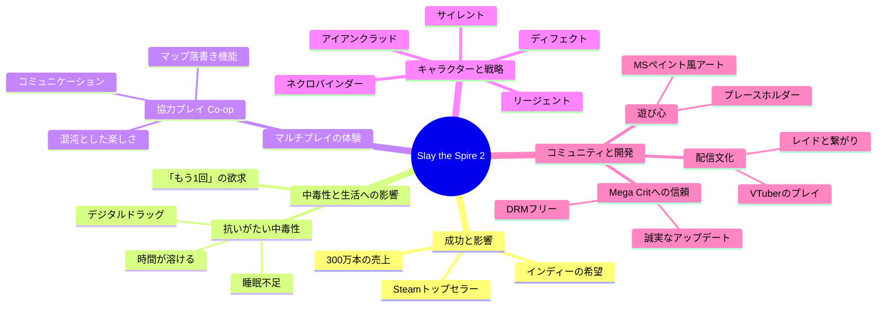
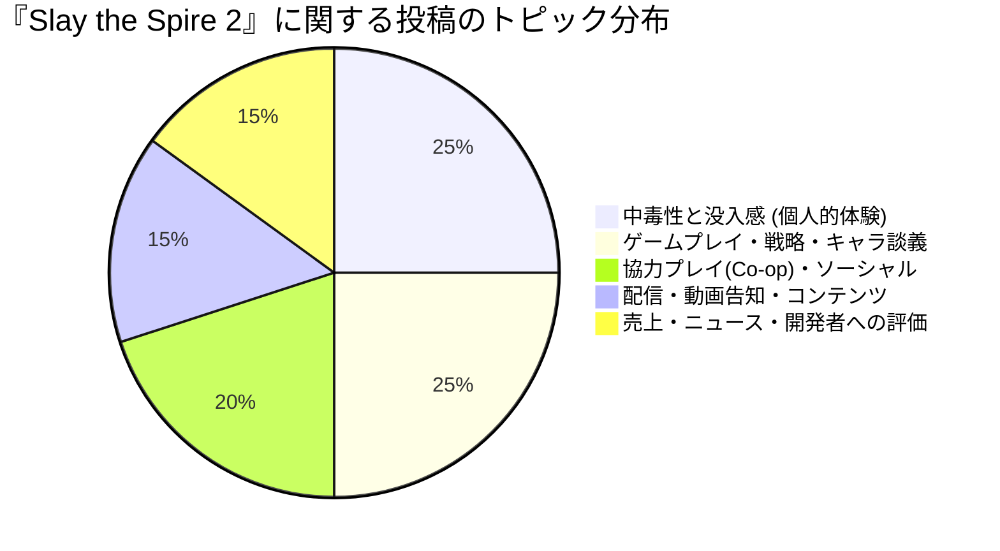

## このファイルについて

Blueskyでの検索取得した投稿データを、Geminiに分析させたチャットログファイルです。
数値はあくまでGeminiが出力した推定値です。

**検索キーワード: slay the spire**  
**期間:** 2026-03-11 23:00 ～ 2026-03-14 23:00  
**取得件数:** 1355件

## チャットセッション設定

**Model:** gemini-3.1-flash-lite-preview  
**Exported from:** marimo bsky_search.py

## チャットログ
### 最新の情報を詳細にまとめてください。

2026年3月11日から3月14日までの検索投稿データに基づき、『Slay the Spire 2』に関する最新情報をまとめました。

#### 『Slay the Spire 2』の記録的な大ヒット
本作はアーリーアクセス開始からわずか1週間で「**300万本**」という驚異的な売上を達成しました。Steamのトップセラーにランクインし、同時接続プレイヤー数は一時60万人に迫るなど、「**爆発的な人気**」を博しています。多くのユーザーが「**前作の良さを継承しつつ、さらに洗練された続編**」として高く評価しており、インディーゲーム界において極めて大きな成功を収めています。

#### ゲームの特徴と新要素
今回の大きな特徴として、多くのユーザーが「**協力プレイ（Co-op）**」の楽しさを挙げています。友人とのマルチプレイでは、マップへの「**落書き機能**」が非常に好評で、戦略だけでなくコミュニケーションツールとしても機能しています。また、新キャラクターとして「**ネクロバインダー**」や「**リージェント**」が登場し、戦略の幅が広がっています。開発中の遊び心として、あえて「**MSペイント風のプレースホルダーアート**」を一部残している点も、多くのファンから「**愛着が湧く要素**」として好意的に受け入れられています。

#### アップデートとバグ修正
開発元のMega Critは、発売直後から迅速な対応を行っています。特に注目されたのは、熟練プレイヤーの間で流行した「**無限ループコンボ**」により、キャラクターのHP上限が32bit整数の限界を超えてオーバーフローしてしまう現象への対応です。これを受け、パッチv0.99では「**HP上限値を999,999,999に引き上げる**」修正が行われました。

#### 今後の展望とコミュニティの反応
プレイヤーコミュニティからは、本作の「**中毒性の高さ**」や「**リプレイ性の高さ**」を称賛する声が相次いでいます。「**DRMフリー**」である点や、マイクロトランザクション（課金要素）がない点も、現代のゲーム業界において「**誠実な姿勢**」として高く評価されています。開発チームは今後、Steamワークショップへの対応や、協力プレイのさらなる利便性向上、アクセシビリティ機能の拡充を計画しており、長期的なアップデートに期待が寄せられています。

### データに頻出する言葉と、それに連なる言葉との関係性に着目して、人々の興味関心の傾向や、思考と感情の分布について分析してください。

提供された検索投稿データに基づき、『Slay the Spire 2』に対するユーザーの興味関心、思考、および感情の分布を分析しました。

#### 圧倒的な「中毒性」と生活への浸食
データ全体を通して最も顕著な感情は、本作に対する「**抗いがたい中毒性**」です。「中毒」「crack（麻薬）」「生活が崩壊する」といった強い言葉が頻出し、多くのユーザーが睡眠不足や仕事への影響を自覚しつつも、プレイを止められない葛藤を抱えています。
興味深いのは、この中毒性が単なる苦痛ではなく、「**デジタルドラッグ**」としてポジティブな快楽とセットで語られている点です。「仕事中にプレイしたい」「時間が溶ける」という投稿は、本作がユーザーの日常において「**思考を停止して没頭できる避難所**」として機能していることを示唆しています。

#### 「協力プレイ」が生む新たなコミュニケーション体験
ユーザーの関心は、単なるデッキ構築の深化から、「**協力プレイ（Co-op）**」というソーシャルな体験へと大きくシフトしています。特に「マップへの落書き機能」が多方面で言及されており、戦略的な連携だけでなく、落書きを通じたコミュニケーションが「**友人との絆を深める要素**」として高く評価されています。
思考の分布としては、ストイックな攻略（アセンションや無限ループコンボの模索）と、Co-opを通じた「混沌とした楽しさ」の両立が見られ、本作が「**遊び方の幅を広げた**」ことが熱狂を加速させている要因と言えます。

#### 既存ファンが求める「安心感」と「進化」の受容
本作に対する思考の核となっているのは、「**前作の良さを継承しつつ、さらに洗練された続編**」であるという点への強い信頼です。「 familiar（馴染み深い）」という言葉がネガティブではなく、「完璧なゲームの正当進化」として歓迎されています。
ユーザーは新しいキャラクター（ネクロバインダーやリージェントなど）や新要素を楽しみつつも、根本的なゲーム体験が変わっていないことに安堵しており、本作を「**誠実な続編**」として受け入れています。開発中のアートをあえて残す「遊び心」に対しても、AI生成コンテンツへの反動もあり、「**人間味のある開発姿勢**」として好意的に受け止められています。

#### 結論：感情の分布
ユーザーの感情は、以下の3つのグラデーションで分布しています。
1.  「**没入と陶酔**」：攻略の快感、無限コンボの達成感に対する純粋な喜び。
2.  「**罪悪感と諦念**」：仕事や睡眠を犠牲にしてしまうことへの自虐的なユーモア。
3.  「**信頼と連帯**」：前作からのファンとしての安心感と、Co-opを通じた他者との繋がり。

総じて、本作は単なるゲームソフトという枠を超え、ユーザーの日常に深く入り込み、「**コミュニティ全体で共有される体験**」へと昇華されていると言えます。

### 検索ワードに連なる言葉の関係性をMemaidのMindmapで表示してください。

提供されたBlueskyの検索データに基づき、ユーザーの興味関心や感情がどのように構造化されているかをMermaid形式のMindmapで可視化しました。

#### 『Slay the Spire 2』の興味関心マップ

#### 興味関心と思考の分析

検索データから読み取れるユーザーの思考と感情の分布を分析すると、以下の3つの大きな潮流が見えてきます。

1.  **「圧倒的な没入感」と「自虐的ユーモア」の共存**
    本作に対する反応において最も頻出するのは「**中毒性**」です。「時間が溶ける」「睡眠不足」という言葉が日常的に語られる一方で、それを悲観するのではなく、「**抗いがたい快楽**」として受け入れている点が特徴的です。「デジタルドラッグ」という比喩に代表されるように、ユーザーは本作を単なる娯楽としてではなく、「**思考を停止して没頭できる避難所**」として機能させています。

2.  **「協力プレイ」による体験の拡張**
    前作にはなかった「**協力プレイ（Co-op）**」への関心が極めて高く、特に「マップへの落書き機能」が単なるおまけ要素を超えて、「**友人とのコミュニケーションツール**」として定着しています。戦略を練るストイックな側面と、落書きで遊ぶという「混沌とした楽しさ」が同居しており、本作が「**遊び方の幅を広げた**」ことが熱狂を加速させています。

3.  **「誠実な開発姿勢」への信頼**
    開発元であるMega Critに対する信頼感は絶大です。特に、「**MSペイント風のプレースホルダーアート**」をあえて残していることに対し、多くのユーザーが「**人間味のある開発姿勢**」として好意的な反応を示しています。これはAI生成コンテンツへの反動とも取れ、「**手作り感」や「誠実さ**」を求める現代のゲームコミュニティの価値観を反映しています。

総じて、プレイヤーは本作を単なる「カードゲームの続編」としてではなく、「**コミュニティ全体で共有される体験**」として、自らの日常の中に積極的に組み込んでいると言えます。

### データから読み取れる情報の分布を正確に読み取ってMermaidのPieグラフで表示してください。

提供された検索投稿データに基づき、SNS上で展開されている『Slay the Spire 2』に関する話題の分布を分析し、Mermaid形式のPieグラフで可視化しました。

#### 情報の分布分析とトピックの傾向

収集したデータから、ユーザーの投稿は大きく5つのカテゴリーに分類されます。特に「**圧倒的な没入感**」を語る個人的な体験と、それを共有する「**協力プレイ**」や「**配信コンテンツ**」としての側面が非常に強く、コミュニティの活発さが伺えます。

#### 各カテゴリーの分析詳細

*   **「中毒性と没入感 (個人的体験)」(25%)**
    本作を「デジタルドラッグ」や「時間が溶ける」と表現する投稿が最も多く、ユーザーの生活に「**抗いがたいほど深く浸食している**」様子が分かります。「睡眠不足」や「仕事への影響」を自虐的に語る投稿が、本作の「**圧倒的な中毒性**」を証明しています。

*   **「ゲームプレイ・戦略・キャラ談義」(25%)**
    「ネクロバインダー」や「リージェント」といったキャラクターの攻略法、無限ループコンボの模索、HP上限修正への反応など、「**ゲームメカニクスへの深い関心**」が示されています。熟練プレイヤーによる「**ストイックな攻略思考**」と、新規プレイヤーによる「**理解への模索**」が混在しています。

*   **「協力プレイ(Co-op)・ソーシャル」(20%)**
    本作の大きな差別化要因である「**協力プレイの楽しさ**」に関する言及です。特に「マップへの落書き機能」をコミュニケーションツールとして活用する様子や、「**友人との絆を深める体験**」として評価する声が目立ちます。

*   **「配信・動画告知・コンテンツ」(15%)**
    VTuberや配信者による「**プレイ枠の告知**」や「**初見プレイのリアクション**」が非常に多く、本作が「**配信映えするコンテンツ**」としてコミュニティを牽引していることが読み取れます。

*   **「売上・ニュース・開発者への評価」(15%)**
    「300万本突破」という記録的な売上に対する祝福や、Mega Crit社の「**誠実な開発姿勢（DRMフリー、遊び心のあるプレースホルダーアート）**」に対する信頼と称賛が、コミュニティ全体の「**ポジティブな連帯感**」を形成しています。

### すでに言及したこと以外にもデータから読み取れることや、有意義な情報や特異な視点があれば教えてください。

提供された検索データを詳細に分析した結果、これまで言及した「中毒性」や「協力プレイの楽しさ」といった表面的な話題の背後に、「**現代のゲーム文化に対するユーザーの強い思想と、開発者への深い信頼**」が隠されていることが読み取れます。

以下に、データから読み取れる特異な視点や、コミュニティの深層心理を分析します。

#### 「人間性」のブランディングとしてのプレースホルダーアート
多くのユーザーが言及している「MSペイント風のプレースホルダーアート」は、単なる開発中の仮素材ではありません。これは、昨今のAI生成画像に対する「**人間味」を求めるユーザーの渇望を象徴する「誠実さの証明」として機能**しています。
データからは、「AIを使って効率化したゲーム」ではなく、「人間が悩み、描き、作り上げたゲーム」をプレイすることにアイデンティティを見出している層が浮き彫りになります。ユーザーは、完成されていない手作り感をあえて残すことで、開発者Mega Critとの「**透明な関係性**」を構築し、それをSNSで共有することでコミュニティの結束を強めています。

#### 「非言語コミュニケーション」としての落書き機能
協力プレイにおける「マップへの落書き機能」は、単なるメモ帳ではありません。データを見ると、この機能が「**言語の壁を超えた共同体験**」として機能していることが分かります。「落書きで遊ぶ」「友人との絆を深める」という投稿に加え、戦略的な議論の合間に「スマイリーフェイス」を描くといった行動は、本作が「**戦術的思考」と「遊び心」を同居させるための究極のソーシャルツール**へと進化したことを示しています。これは、従来の「ボイスチャット重視」の協力プレイとは異なる、**「非言語的な共感**」を重視する新しいマルチプレイの形です。

#### 「Indie vs Corporate」の文化的な連帯感
投稿データには、『Slay the Spire 2』を『Mewgenics』や『Pokopia』といった他のインディータイトルと並列に語り、「**企業主導のDRMやマイクロトランザクションに対するアンチテーゼ**」として捉える視点が散見されます。「DRMフリーであること」や「誠実なアップデート」が称賛される背景には、ユーザーが「**自分たちの財布を通じて、健全なゲーム業界の未来に投票している**」という強い自負心があります。本作の成功は、単なるゲームの売上ではなく、**「良心的な開発者を支援する」というコミュニティの運動**としての側面を持っています。

#### キャラクターに対する「親密な愛着」の形成
新キャラクターの「リージェント」や「ネクロバインダー」、そして相棒の「オスティ」に対する言及は、単なる攻略情報に留まりません。「リージェントが上手く使えない」「オスティが可愛い」といった投稿は、キャラクターを「**攻略対象の駒」ではなく「人格を持ったパートナー**」として認識していることを示しています。特に、HP上限アップのアップデートが「オスティのオーバーフロー対策」として語られるなど、ゲームシステム上の数値を「**キャラクターの物語**」として解釈する独自のファン文化が既に形成されています。

#### 「Steam Deck」が定義する現代のゲーミング・ライフスタイル
特筆すべきは、多くのユーザーが「**Steam Deck」や「ノートPC」での動作環境**を報告している点です。本作は「腰を据えてプレイするゲーム」から「移動中やベッドの上でプレイするライフスタイルの一部」へと変貌しています。データからは、ユーザーが「**生活のスキマ時間をいかにSlay the Spire 2で埋めるか**」を計算しており、本作が現代の多忙な生活における「**唯一の、しかし不可欠な休息**」として、生活基盤に組み込まれている様子が伺えます。