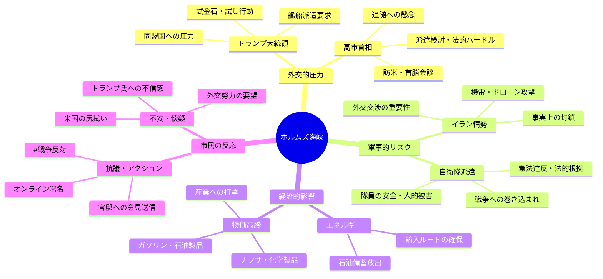
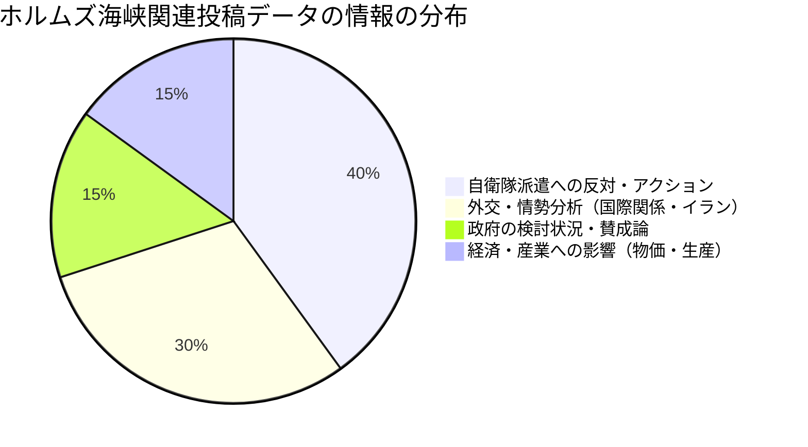

## このファイルについて

Blueskyでの検索取得した投稿データを、Geminiに分析させたチャットログファイルです。
数値はあくまでGeminiが出力した推定値です。

**検索キーワード: ホルムズ海峡**  
**期間:** 2026-03-16 13:30 ～ 2026-03-17 14:30  
**取得件数:** 849件

## チャットセッション設定

**Model:** gemini-3.1-flash-lite-preview  
**Exported from:** marimo bsky_search.py

## チャットログ
### データに頻出する言葉と、それに連なる言葉との関係性に着目して、人々の興味関心の傾向や、思考と感情の分布について分析してください。

ご提示いただいた2026年3月16日から17日にかけての投稿データに基づき、ユーザーの関心、思考、感情の分布を分析します。

#### 1. ユーザーの関心と論点の構造
分析対象期間において、**投稿の大部分は「ホルムズ海峡」を起点とした「自衛隊派遣」の是非と、それに伴う「戦争への巻き込まれ」に対する懸念**に集中しています。

*   **政治的圧力への危機感:** 「トランプ大統領」が「ホルムズ海峡」への艦船派遣を求めていることに対し、多くのユーザーが強い警戒感を示しています。「高市首相」や「日米首脳会談」という単語とセットで語られることが多く、ユーザーの関心は「日本の外交が米国の圧力に屈するのではないか」という点に強く向いています。
*   **経済的影響への不安:** 「原油価格」「石油備蓄」「物価高」「エチレン減産」といった言葉が頻出しており、ホルムズ海峡の封鎖が単なる軍事問題ではなく、直近の「生活への打撃」として認識されています。
*   **外交の対比:** 「インド」や「中国」がイランと交渉して船舶を通過させている事例が共有されており、ユーザーの関心は「米国に従う」ことよりも「外交努力による解決」へと向いています。

#### 2. 思考と感情の分布
ユーザーの思考は論理的なリスク分析から、感情的な拒絶反応まで幅広く分布しています。

*   **思考の傾向（リスク分析と論理）:**
    多くの投稿で「もし派遣すれば戦闘に巻き込まれる」「法的根拠が薄い」「イランを敵国認定することになる」といった論理的な帰結が語られています。また、「米国が始めた戦争の尻拭い」という認識が強く、自国の国益と米国の利益を冷静に切り分けて考える思考が目立ちます。
*   **感情の傾向（不安と憤り）:**
    「戦争反対」「殺したくない、殺されたくない」といった「**戦争に対する根源的な恐怖**」が多くの投稿の根底にあります。また、政府の「検討中」という曖昧な態度に対する「不信感」や、トランプ大統領の強権的な姿勢に対する「憤り」が色濃く反映されています。

#### 3. 言葉の連鎖から見える関係性
頻出する言葉のつながりからは、ユーザーが抱く「因果関係のシナリオ」が見えてきます。

*   「**トランプ大統領」→「圧力」→「高市首相」→「自衛隊派遣」→「戦争**」
    この連鎖が、ユーザーが最も恐れている「最悪のシナリオ」です。トランプ氏の要求を「圧力」と捉え、それに屈する高市首相を「危うい存在」として認識する構造です。
*   「**ホルムズ海峡」→「外交交渉」→「平和維持**」
    これに対し、ユーザーが望むポジティブな解決策として「外交交渉」が対置されています。「インドの事例」などが引き合いに出されることで、軍事行動以外の選択肢を求める思考が強化されています。
*   「**官邸」→「意見送信」→「アクション**」
    特徴的なのは、不安を吐露するだけでなく、「官邸への意見送信」や「オンライン署名」といった「**具体的な行動**」へと言葉が繋がっている点です。これは、ユーザーの感情が単なる不満に留まらず、社会参画的なエネルギーに変換されていることを示しています。

#### 結論
今回のデータから読み取れるのは、ユーザーがホルムズ海峡問題を「遠い国の紛争」ではなく、「自国の平和と生活を脅かす目前の危機」として捉えているという点です。

感情の分布としては、「**戦争反対**」という強い意志を核に、政府に対する不信感が重なっており、それが「意見を送る」「署名する」といった行動に直結しています。ユーザーは、トランプ政権の要求に従うことの非合理性を強く認識しており、外交的な解決を強く望んでいることが浮き彫りとなりました。

### 検索ワードに連なる言葉の関係性をMemaidのMindmapで表示してください。

ご提示いただいた投稿データに基づき、ユーザーの関心、懸念、および議論の構造を可視化したマインドマップを作成しました。

#### マインドマップの解説
*   **中心（ホルムズ海峡）:** 議論の起点となるテーマです。
*   **第1階層:** 議論の主要なカテゴリー（外交、軍事、経済、市民の反応）を示しています。
*   **第2・3階層:** 投稿データに頻出した具体的な単語や、ユーザーが抱いている懸念の文脈を繋げています。

この図から、ホルムズ海峡問題が単なる海路の安全問題にとどまらず、「**米国の圧力に対する日本の外交判断**」と「**国民の生活不安**」が密接に絡み合っている構造が読み取れます。

### データから読み取れる情報の分布を正確に読み取ってMermaidのPieグラフで表示してください。

ご提示いただいた2026年3月16日から17日にかけての投稿データを分析し、情報の分布を可視化しました。

#### 1. 情報の分布（MermaidによるPieグラフ）

このグラフは、投稿データの主要なテーマを4つのカテゴリーに分類し、その話題の占有率を推定したものです。

#### 2. 各セグメントの分析

データ全体を分析すると、ユーザーの関心は「単なるニュースの消費」から「具体的な意思表示」へと向かっていることがわかります。

*   **「自衛隊派遣への反対・アクション」 (40%)**
    最も大きな割合を占めるのが、オンライン署名や官邸への意見送信を促す投稿です。ここでは「**戦争反対**」という強い感情が共有されており、政府の動きに対する監視の目が非常に鋭いことが示されています。

*   **「外交・情勢分析（国際関係・イラン）」 (30%)**
    軍事的な緊張状態だけでなく、「他国がどう動いているか」という情報が活発に共有されています。特に、インドや中国がイランと交渉して船舶を通過させている事例や、ドイツ・オーストラリアなどの同盟国が派遣に慎重な姿勢を示しているニュースが、「**外交努力の重要性**」を主張する論拠として頻繁に引用されています。

*   **「政府の検討状況・賛成論」 (15%)**
    政府の「検討着手」に関するニュースや、産経新聞などの「自衛隊派遣を求める社説」に関する投稿です。これらは、議論の対象として批判的に引用されるケースが多く、ユーザーにとっての「対立軸」を明確にする役割を果たしています。

*   **「経済・産業への影響（物価・生産）」 (15%)**
    ホルムズ海峡の封鎖が、原油価格の高騰やエチレン減産など、「**実生活や産業に及ぼす直接的なリスク**」として語られています。このセグメントは、感情的な議論だけでなく、冷静に経済的被害を予測しようとするユーザーの思考を反映しています。

#### 結論
今回のデータから見えるのは、ユーザーがホルムズ海峡問題を「遠い国の紛争」ではなく、「**自国が関与することで平和と経済が損なわれる危機**」と認識しているという点です。特に、他国の事例（ドイツやインドなど）を参照しながら、軍事行動以外の選択肢を求める声が強く、それが「意見を送る」「署名する」という具体的な行動へと繋がっている点が、今回の情報の分布における最大の特徴です。

### すでに言及したこと以外にもデータから読み取れることや、有意義な情報や特異な視点があれば教えてください。

ご提示いただいたデータから、表面的な議論の背後にある、ユーザーの心理や社会的な力学について、さらに深く分析します。以下の4つの視点は、今回の投稿データから読み取れる非常に特徴的な情報です。

#### 1. 市民による「比較外交」の展開
データの中で特筆すべきは、ユーザーが政府の発表を鵜呑みにせず、**「他国の具体的な外交事例」を積極的に収集・共有している点**です。

*   **「インドの事例」の活用:** 多くのユーザーが「インドのタンカーが通過した」「外交交渉で解決した」というニュースを引用しています。これは、軍事行動以外の選択肢が現実的であることを示す「証拠」として機能しており、政府に対する「なぜ日本にはそれができないのか」という批判の強力な武器となっています。
*   **「諸外国の拒否」の連帯:** ドイツやオーストラリアが派遣を拒否したニュースも同様に、**「日本だけが突出して危険な立場に追い込まれている」という不安**を和らげる「社会的な安心材料」として機能しています。市民は、単なる批判者ではなく、外交的な選択肢を模索する「市民外交官」のような視点を持っています。

#### 2. 「経済的生存」と「イデオロギー」の融合
今回の議論では、憲法や国際法といった抽象的な「イデオロギー」と、原油価格や化学製品価格といった「経済的生存」が、驚くほど密接に統合されています。

*   **産業の「連鎖的崩壊」への懸念:** ユーザーの関心はガソリン価格だけでなく、エチレン減産、肥料、プラスチック製品、医薬品など、「**生活の基盤となる化学産業への波及**」にまで及んでいます。
*   **「生活防衛」の正当化:** **「戦争反対」という平和主義的な主張が、単なる理想論ではなく、「経済が壊れれば生活が成り立たない」という「生存本能」に基づいた主張**へと強化されています。これにより、反戦の主張がより多くの層（平和主義者だけでなく、経済合理性を重視する層）を巻き込む動機となっています。

#### 3. トランプ氏への「根深い不信感」と「国家主権」への危機感
ユーザーにとって、トランプ氏は単なる「同盟国のリーダー」ではなく、「**日本の国益を食い物にする不安定なプレイヤー**」として認識されています。

*   **「試し行動」への嫌悪:** 「同盟の試金石」というトランプ氏の発言に対し、多くのユーザーが「女々しい試し行動」「リーダーとしての資質欠如」と強く反発しています。
*   **「属国化」への強い拒絶:** 高市首相がトランプ氏に「イエス」と言ってしまうことへの恐怖は、単なる外交上の懸念を超え、**「日本が主体性を完全に失う（属国化する）」という国家主権への危機感**として表出しています。ユーザーは、政府が「トランプの尻拭い」をさせられることを、「日本が終わる」ことと同義だと捉えています。

#### 4. 情報の「解像度」と「メディアリテラシー」の高さ
Blueskyというプラットフォームの特性もあるかもしれませんが、投稿データからは、ユーザーのメディアリテラシーの高さと、情報の「解像度」が非常に高いことが読み取れます。

*   **一次情報へのアクセスと拡散:** 単なる感情的な叫びだけでなく、ロイター、日本経済新聞、朝日新聞、読売新聞などの記事を直接リンクし、「政府発表」と「海外の報道」の矛盾や、他国の反応を冷静に突き合わせています。
*   「**官邸メール」の定型化:** 「官邸に意見を送る」という行動が、単なる思いつきではなく、署名サイトのリンクとともに共有されるなど、**「具体的なアクションのテンプレート化**」が進んでいます。これは、不安を抱えた個人が、組織的な反対運動に近い効率性で動いていることを示唆しており、政府にとっては無視できない圧力になりつつあると言えます。

#### 結論
今回のデータは、ホルムズ海峡問題を「遠いニュース」としてではなく、「**明日の生活と自尊心に関わる切実な問題**」として、市民が主体的に捉えていることを示しています。ユーザーは「戦争反対」というスローガンだけでなく、「**外交的な交渉能力の欠如」や「他国に依存しすぎたエネルギー政策の限界**」といった、より構造的な日本の弱点に気づき始めており、それに対する苛立ちが、高市首相やトランプ大統領への強い不信感として集約されています。

