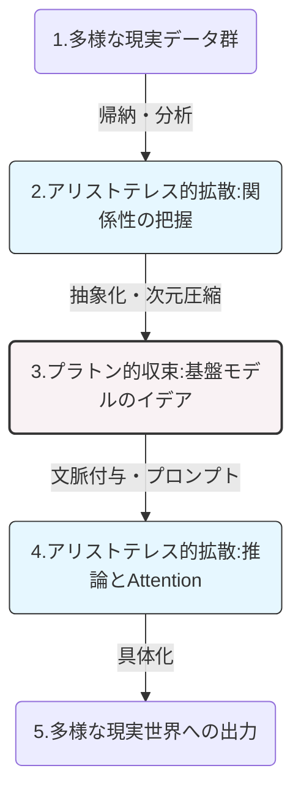

# AI表現におけるプラトン的収束とアリストテレス的拡散の構造

> [!SUMMARY] 概要
> 大規模AIモデルが世界の同一の普遍的構造（イデア）に収束するという「プラトン的仮説」に対し、概念の局所的な関係性において一致するという「アリストテレス的仮説」が提唱された。この対立は、モデルの「開発（マクロな収束）」と「出力（ミクロな拡散）」という動的な力学として統合的に解釈可能である。

---

## 主要な課題・動機
- AIシステムがより高性能になった際、異なるデータ（テキスト、画像等）で学習したモデル同士が同じ「世界の認識」に到達するのかという疑問の検証。
- MITが提唱した「**プラトン的表現仮説**」（単一の普遍的空間への収束）に対する、EPFLによる反証と新たな概念的枠組みの提示。
- 哲学的な対立（普遍的イデア vs 個別的関係性）を、現代AIの学習・推論メカニズムの比喩としてどのように解釈すべきかの整理。

## ユーザーの主要な視点・仮説
- プラトンとアリストテレスは単純な対立構造ではなく、「概念同士の関係性の構造そのものが普遍性を表現している」という統合的視点。
- ラファエロの『アテナイの学堂』における両者のジェスチャー（天を指すプラトン、地を覆うアリストテレス）は、ミクロとマクロ、拡散から収束、収束から拡散への動的な運動構造を示しているという仮説。
- 出力結果（使う側）から観察するとAIは「**アリストテレス的**」に見え、モデルを構築する側（作る側）から観察すると「**プラトン的**」に見えるという本質的なパラダイムの指摘。

---

## 得られた知見・知識

### 1. 2つのAI表現仮説と哲学的背景

AIモデルの表現学習プロセスにおける見解の相違は、古代ギリシャの哲学的アプローチに符号する。

| 概念 | MITの提案：「**プラトン的表現仮説**」 | EPFLの提案：「**アリストテレス的表現仮説**」 |
| :--- | :--- | :--- |
| **哲学的基盤** | プラトンの「**イデア論**」（超越的な普遍性の重視） | アリストテレスの「**カテゴリー論**」（関係性・文脈の重視） |
| **AIにおける意味** | モデルはデータ種別によらず、唯一の絶対的で普遍的な幾何学的構造（グローバル座標）に収束していく。 | モデルの全体的な空間構造は異なっても、概念同士の局所的な近傍関係（ローカル構造）において共通の知識体系を持つ。 |
| **視座の特徴** | マクロ・垂直方向・演繹的 | ミクロ・水平方向・帰納的 |

### 2. トポロジー（関係性の構造）としての普遍性

プラトンとアリストテレスの思想は、20世紀以降の構造主義的・数学的観点からは対立せず統合される。
普遍性とは特定の場所に孤立して存在する実体ではなく、「**要素間に成り立つ関係性のパターン（構造）**」そのものである。EPFLの研究が示した「概念同士の局所的な近傍関係の共通性」は、AIがモデルという器の違いを超えて、概念間の相対的なトポロジーという不変量（普遍性）を獲得していることを意味する。

### 3. 開発側とユーザー側における認識の逆転構造

AIシステムの認識の運動は、「収束（次元圧縮）」と「拡散（関係性の展開）」のループとして記述できる。観察する立場により、AIの振る舞いは以下のように逆転して捉えられる。

*   **モデルを作る側（プラトン的収束）**：
    *   基盤モデルの開発では、ノイズの多い多様な現実データ（多）から、データ形式を問わない共通の巨大な数学的空間（一）への**次元圧縮**と最適化を目指す。これは「**イデア**」への到達を渇望する垂直方向の運動である。
*   **出力・ユーザー側（アリストテレス的拡散）**：
    *   プロンプトを通じた推論プロセスでは、唯一の正解ではなく、入力された言葉の関係性や文脈（カテゴリー）に依存して出力を変化させる（In-context learning）。
    *   TransformerのAttention機構は単語間の相対距離を計算するものであり、高次元のイデアを具体的文脈へと**解凍**・展開（拡散）する水平方向の運動である。

### 4. 認識運動のダイナミズム（フロー図）

---

## 要点のまとめ
> [!NOTE] 
> - AI表現に関する「プラトン的（全体収束）」と「アリストテレス的（局所的関係性）」の議論は、AIが世界の構造をどうモデル化しているかを示す重要なメタファーである。
> - 普遍性は絶対空間の単一座標ではなく、「概念同士の相対的な関係性（構造）」の中に宿る。
> - AIの全体像は「開発者＝イデアを目指すプラトン」「ユーザー＝文脈を展開するアリストテレス」という、圧縮と解凍の動的ループとして理解できる。

---

## 関連情報・参考リンク
- [AIシステムは世界を同じように捉えるようになるのか？ (EPFL News)](https://actu.epfl.ch/news/do-ai-systems-learn-the-same-view-of-the-world/)
- [関連論文（arXiv）](https://arxiv.org/abs/2602.04183)

## 記事の要約

スイス連邦工科大学ローザンヌ校（EPFL）の研究チームは2026年6月8日、高度なAIモデルが世界の同一の構造を学習しているとする仮説に対し、その根拠となる類似度指標の数学的偏りを指摘する論文を発表した。本記事では、AIの内部表現に関する従来の仮説の問題点と、新たに提唱された見解について解説する。

### AIの「内部表現」と先行研究の前提

現代のAIシステムは、テキストや画像、音声など異なる形式のデータを学習する。AIの内部において「犬」や「車」といった概念は、高次元空間におけるベクトル（方向と大きさを持つ数値の集まり）として表現される。

2024年にマサチューセッツ工科大学（MIT）の研究者らは、モデルの性能が向上するにつれて、データの種類に関わらずこれらの内部表現が類似していくという仮説を提唱した。これは古代ギリシャの哲学者プラトンが唱えた普遍的な理想形に擬え、「プラトン的表現仮説」と呼ばれている。この仮説は、異なるデータで訓練されたAIであっても、独立して同じ世界の根源的構造に収束していく可能性を示唆していた。

### 高次元空間における測定指標の錯覚

EPFLのMaria Brbic助教らの研究チームは、このモデル間の類似性を示すスコアの数学的根拠を検証した。その結果、モデルが共通の構造を学習したからではなく、類似度を測定する手法そのものに起因してスコアが上昇している現象を確認した。

これは、私たちが日常的に認識する3次元空間とは異なる、高次元空間特有の数学的性質によるものである。たとえば、極めて複雑で広大な空間内では、全く無関係な要素同士の距離が計算上はほぼ等しくなってしまう「距離の集中」という現象が発生する。実際、一度もデータを学習していない完全にランダムなAIモデル同士を比較した場合でも、類似度指標がゼロにならないことが判明した。研究チームは、指標がAIの共有構造ではなく、単なる数学的なベースラインを検出しているに過ぎないと指摘している。

### 全体的な統合から局所的な関係性への移行

研究チームは、AIシステムが全体として一つの普遍的表現に収束するという見方を否定した一方で、ある特定の類似性は維持されることを発見した。それは、概念同士の局所的な関係性である。

モデル全体の構造が異なっていても、「車は別の車の近くに」「動物は別の動物の近くに」配置されるというように、関連する概念同士は安定したグループを形成する傾向がある。この発見に基づき、研究チームは新たに「アリストテレス的表現仮説」を提唱した。普遍的な理想形を重視したプラトンに対し、その弟子であるアリストテレスが個々の関係性やカテゴリー、文脈を重視した歴史的背景を、AIの知識構築の傾向に適用したものである。

### AI開発における今後の課題と展望

先行研究が支持された背景には、AIが高度化すれば自動的に同じ世界観を共有し、異なるAI同士の比較や統合（アライメント）が容易になるという期待があった。しかし、今回のEPFLの論文は、AIモデルが世界をどう表現するかについて、全体的に大きな差異が残り続けることを示唆している。

同論文は2026年7月に開催される国際会議（ICML）で発表される予定である。研究チームは、今後はどの局所的構造が収束するのかを正確に把握し、より信頼性の高いAIシステムの構築にどのように生かすかが次の課題となるとしている。