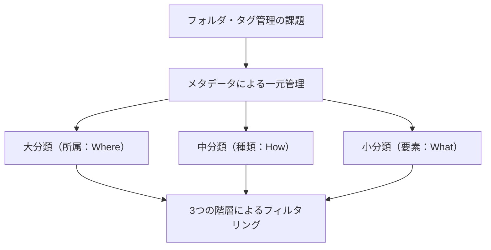

> [!SUMMARY] 概要
> フォルダ管理の硬直性とタグ管理の乱雑さという、それぞれの課題を解決するためのアイデアです。Markdownファイルのメタデータ（フロントマター）に大・中・小の3階層の分類情報を記録して一元管理することで、AIエージェントとのデータ共有や、効率的なファイル検索をスムーズに行えるようになります。

## ファイル管理の問題点のまとめ

### フォルダ管理の問題

フォルダ構造はあらかじめファイルの所属を区分けしておくことで、階層を下りながら目的のファイルを素早く絞り込むことができますが、ファイルへのルートがフォルダに設定されたカテゴリに固定されて、ファイルの所在が散逸してしまいます。

### タグ管理の問題

タグ構造は関連する情報のファイルを横断的に検索したり、他の情報との繋がりを見つける際には有効ですが、時間経過とともに表記揺れが発生したり、一部のタグが肥大化したりと、次第に乱雑化していき、検索時にファイルが重複して絞りきれなくなります。

これら2つの問題点を相殺する折衷案として、フォルダで大まかにファイルを区分して、タグ付けを行うハイブリッドな管理方法もありますが、ファイルの所属は結局そのフォルダに固定されてしまいます。

またAIエージェントに与えるコンテキストファイルを管理する面でも、各エージェントフォルダに個別にスキルやナレッジを用意するよりも、共有できる情報はなるべく一元化して、どこからでも読み込みできるようにしたほうが良いと考えます。

## 解決策の提案

そこで今回考案したのが、ファイルをフォルダごとに区分けして分類するのではなく、Markdownファイルのフロントマターにファイルの所属先を含めたメタデータを記録するという方法です。フォルダが中に入れるファイルを決めるのではなく、ファイル自身に入れるフォルダを決めさせるというアプローチです。

この方法によって、
- ファイルの保管場所を一元化することで、ファイルが散逸せず、各々のAIエージェントがコンテキストファイルを共有することができます。
- ファイルの所属を配列によって複数設定できるようにすることで、情報のサイロ化を防ぎ、他分野に跨って関連する情報を見つけ出すことができます。
- ObsidianのBases機能を利用すれば効率的に目的のファイルを絞り込むことができます。
- フォルダのようなツリー構造で階層を下っていくのではなく、どの階層からでもファイルを絞り込むことが可能になります。

具体的な運用方法として、基本的なファイルの分類を大・中・小の階層に設定します。

## ファイルの分類を大中小の3つの階層に設定する



### 大：ファイルの所属の設定（Where?）

**このファイルが一体どこのカテゴリに属するのか**に着目し、ファイルの大まかな所属、カテゴリ、場所、ドメイン等、フォルダに相当する情報をここに設定します。  

まず最初に、大きすぎず小さすぎない、普遍性と包摂性のある分類区分を予め厳格に定義し、カテゴリリストを作成するなどして、分類ルールの参照と共有ができるようにします。  
例えば、図書館の本やニュースのジャンルのように、歴史、経済、音楽、映画といった大きなカテゴリを定義します。

運用する際は、  
- カテゴリリストに定義されたルールに基づいてファイルの所属を決定します。
- タグ(配列)形式で複数の所属先を割り当てても構いません。
- 入力する際はObsidianなどのサジェスト機能を使用することで、表記揺れを防ぐことができます。
- なるべく最小限のカテゴリでの運用を心がけます。
- 新しいカテゴリを追加する場合は、カテゴリリストに新しいファイルカテゴリを定義します。

### 中：ファイルの種類の設定（How?）

**このファイルが一体どのような文書であるか**に着目し、ファイルの種類、タイプ、フォーマットをここで設定します。

ファイルの所属と同様にファイルのタイプを定義したリストを作成して分類ルールの参照と共有ができるようにします。  
例えば、メモ、マニュアル、ナレッジ、日記、システムプロンプト等  

運用する際は、  
- タイプリストに定義されたルールに基づいてファイルのタイプを決定します。
- ファイルタイプは必ず一つに限定します。
- 新しい文書形態を追加する場合はタイプリストに新しいファイルタイプを定義します。

### 小：ファイルの内容を構成している主要な成分、要素の設定（What?）

**ファイルの内容を構成している主要な成分、要素**に着目して、タグを記述します。

運用する際は、  
- なるべく統一したタグ付けを意識しながら運用します。
- 入力する際はObsidianなどのサジェスト機能を使用することで、表記揺れを防ぐことができます。
- けれども新しいタグは気楽に追加して構いません。
- タグの表記揺れは、識別する人間やAIの側で、ある程度吸収できます。
- 運用しながら多用・頻出するようになったタグは、所属への昇格を判断します。

### フロントマターのサンプル
各ファイルの先頭に以下のようなYAML形式のフロントマターを記述して、3つの階層を表現します。
他に必要な情報があればプロパティを追加します。

```yaml
---
title: うんたらかんたら
date: 2026-06-21T12:00:00
description: うんたらかんたら
categories: ["歴史", "経済"] # 大分類（所属・複数指定が可能）
format: "ナレッジ" # 中分類（文書の種類やフォーマット・1つに限定）
tags: ["享保の改革", "徳川吉宗", "米価"] # 小分類（構成要素・気楽に付与）
author： わたし
---
```

### 3つの階層でフィルタリングする

Obsidian Basesを利用すれば、設定した所属、種類、要素を組み合わせることで目的のファイルを絞り込むことができます。  たとえば、歴史と経済（所属）に関するナレッジ（種類）や、ねずみ（要素）に関する映画（所属）のリスト（種類）のように、フォルダのように階層を下っていくだけではなく、どの階層からでもファイルを絞り込むことが可能になります。  また、AIエージェントに所属と種類のリストを渡して、検索用のツールを用意すれば、AIに読み込ませたいファイルを効率よく絞り込むこともできます。

### メンテナンスはAIにおまかせする

タグの運用は時間経過とともに無秩序化していくので、肥大化したタグの昇格処理や、表記揺れを統一するようなメンテナンス作業が必要になりますが、これらの作業は人間には不向きかつ、負担になるので、AIエージェントにまかせたり、変換スクリプト等を作成してもらい、機械的に処理してヒューマンエラーを防ぐようなしくみを作りましょう。

## 将来の展望
将来的には現在のOSのフォルダシステムが、Markdownファイルのフロントマターに記述された情報をメタデータとして記録できるようになり、フォルダに該当するカテゴリのファイルを表示閲覧できるようなシステムが実現することを期待しています。
