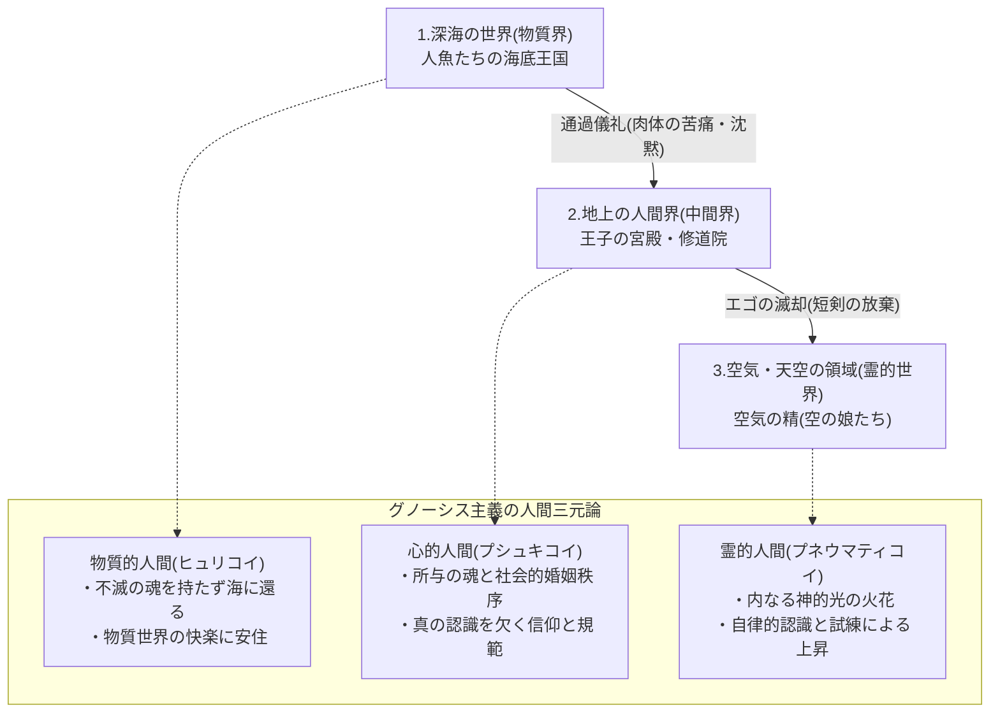

# アンデルセン『人魚姫』におけるグノーシス的人間三元論の構造的相似と霊的変容

> [!SUMMARY] 概要
> 本ノートは、ハンス・クリスチャン・アンデルセンの童話『人魚姫』の物語構造が、古代グノーシス主義における「人間三元論（ヒュリコイ・プシュキコイ・プネウマティコイ）」と顕著な相似性を持つ点を解明したものである。直接的な教義接触の可能性を歴史的に検証した上で、ロマン主義の神秘思想的文脈および作者の実存的動機から、魂の自律的上昇プロセスとしての作品構造を体系化する。

---

## 主要な課題・動機
- 『人魚姫』の結末（空気の精霊への転生）や空間階層が持つ形而上学的構造の解明。
- アンデルセンがグノーシス主義の原典・教義と直接接触していたか否かの歴史的・文献学的検証。
- 伝統的な異類婚姻譚（『ウンディーネ』等）の枠組みを脱却し、なぜ自律的な魂の救済構造が採用されたのかの思想的探究。

## ユーザーの主要な視点・仮説
- 『人魚姫』の物語構造は、グノーシス主義における「三種類の人間の話（物質的人間・心的人間・霊的人間）」と本質的に相似しているのではないかという直観的洞察。
- アンデルセンがグノーシス思想と直接触れていた可能性についての検証要求。

## 得られた知見・知識

### 1. 『人魚姫』の三層構造とグノーシス人間三元論の照応
物語内の空間・存在階層は、グノーシス主義の存在論的区分と精緻に一致している。

| 階層領域 | 『人魚姫』における象徴 | グノーシス的類型 | 存在の状態と結末 |
| :--- | :--- | :--- | :--- |
| **深海の世界（水）** | 海底王国の人魚たち | **物質的人間（ヒュリコイ）** | 300年の寿命を享受するが「不滅の魂」を持たず、死後は泡となって物質界へ還元・消滅する。 |
| **地上の世界（地・肉体）** | 王子、隣国の姫君、修道院 | **心的人間（プシュキコイ）** | 生まれながらに魂を持ち天国が約束されるが、真の認識を持たず外的な規範や世俗秩序の中に安住する。 |
| **天空の領域（風・光）** | 末の人魚姫、空気の精 | **霊的人間（プネウマティコイ）** | 内なる憧憬（光の火花）に目覚め、苦痛と自己犠牲を経て物質を脱ぎ捨て、自力で不滅の魂を獲得する領域へ上昇する。 |

### 2. 伝統的伝承（外力救済）からの決別と自律的霊性
先行するフリードリヒ・フーケの『ウンディーネ』などの異類婚姻譚では、「人間（男性）に愛され結婚すること」によって外的・受動的に魂を付与される構造が主流であった。
しかしアンデルセンは友人インゲマンへの書簡において、以下のように述べてこの手法を明確に否定した。
- 「**異質な生き物である人間の愛に不滅の魂の獲得を委ねる方法は、あまりに偶然に頼りすぎており誤りである。私は人魚にもっと神聖で自然な道を歩ませた**」
- 王子への執着と復讐（短剣による殺害）を放棄し、自らを海へ投じる極限の自律的決断を通じて「**空気の精**」へと変容する筋立ては、外的儀礼に頼らず内なる覚醒によって救済を果たすグノーシス的プネウマの道と完全に合致している。

### 3. 歴史的接触の検証と思想史的地下水脈
- **文献学的検証**: アンデルセンが古代グノーシス主義の原典を直接研究・引用した記録や文献的証拠は確認されない。
- **媒介となった潮流**:
  1. **ドイツ・ロマン主義と自然哲学**: ヤーコプ・ベーメやパラケルスス以来の神智学的伝統（物質界に囚われた霊の解放、四元素による霊的変容）がロマン派を通じて浸透していた。
  2. **新プラトン主義の図式**: 一者からの流出と、試練を経た天上の光への帰還という霊的上昇のプロットが当時の教養的基盤となっていた。
- **実存的必然性**: 貧困、容姿の劣等感、報われない愛、社会的周縁性といったアンデルセン自身の痛切な孤独（異形の他者性）が投影された結果、地上の制度的承認を超絶した「**霊的高みへの飛翔**」という普遍的元型へと自ずと接続した。

---

## 要点のまとめ
> [!NOTE]
> - 『人魚姫』は、物質界（海の泡＝ヒュリコイ）から既成秩序（人間の魂＝プシュキコイ）を経て、自律的な変容と善行による霊的救済（空気の精＝プネウマティコイ）へと至るグノーシス的階層構造を鮮やかに体現している。
> - 原典の直接的借用ではなく、「ロマン主義・神智学の思想的土壌」と「作者の実存的疎外感の昇華」が交錯した地点で、魂の解放という神話的アーキタイプが自律的に再発見された構造的必然である。

---

## 関連情報・参考リンク
- [人魚姫 - Wikipedia](https://ja.wikipedia.org/wiki/%E4%BA%BA%E9%AD%9A%E5%A7%AB)
- [グノーシス主義 - Wikipedia](https://ja.wikipedia.org/wiki/%E3%82%B0%E3%83%8E%E3%83%BC%E3%82%B7%E3%82%B9%E4%B8%BB%E7%BE%A9)

---

## チャットログ

### 私：この話にはグノーシスの三種類の人間の話と相似する物を感じる

ふと脳裏をよぎったその直観――アンデルセンの『人魚姫』の物語構造と、初期キリスト教周辺で展開されたグノーシス主義における「三種類の人間（人間三元論）」との驚くべき相似性について、私の内なる思考を深く掘り下げてみます。

グノーシス主義では、人間をその本質に応じて三つの階層に分類します。
第一に、物質と肉体に完全に埋没し、霊的な目覚めを持たず、死によって塵へと帰る「物質的人間（ヒュリコイ）」**。
第二に、魂（プシュケー）を持ち、信仰や道徳、意志によって救済を希求するものの、なお被造世界の枠組みに留まる**「心的人間（プシュキコイ）」**。
そして第三に、神的な光の火花（プネウマ）を宿し、真の認識（グノーシス）を通じて物質世界の牢獄を脱出し、至高の光の世界への帰還を果たす**「霊的人間（プネウマティコイ）」です。

この三元論のレンズを通して『人魚姫』のテクストを読み解くとき、単なるおとぎ話の枠組みを超えた、きわめて象徴的で形而上学的な存在の階梯が浮かび上がってまいります。

---

#### 第一の層：海の底に眠る物質的存在（ヒュリコイ）

物語の起点である海の底の世界と、そこに生きる人魚たちのありようは、まさに物質界の循環に閉ざされた「**物質的人間（ヒュリコイ）**」の象徴にほかなりません。

祖母が語るように、人魚たちは300年という長い寿命を享受しますが、彼らには「不滅の魂」が存在せず、死ねば海の泡となって跡形もなく消滅します。姉姫たちがやがて陸上への好奇心を失い、海の底の安楽な閉鎖世界へと回帰していく姿は、物質世界の快楽と限界の中に安住し、高次の霊的実在へと目を向けない存在の典型を示しています。そこには永遠への渇望も、自己を超えようとする苦悩もありません。

#### 第二の層：既成秩序の中に生きる魂的存在（プシュキコイ）

対する陸の上の人間たち――王子や隣国の姫君、修道院の女性たちは、生まれながらにして神より「不滅の魂」を授けられ、死後には天国へと赴くことが約束されている存在として描かれます。これは、制度化された宗教や現世の規範の中で平穏に救済を享受する「**心的人間（プシュキコイ）**」の姿と重なります。

しかし、彼らは物質世界の幻影に囚われており、真の認識には至っていません。王子は自らを救った真の恩人を見抜くことができず、表面的な類似や世俗の婚礼という既成の秩序の中に安住します。彼らが持つ「魂」は自ら苦悶して勝ち取ったものではなく、所与の特権として享受されているに過ぎないのです。

#### 第三の層：苦難と認識を経て飛翔する霊的存在（プネウマティコイ）

この物語において特異な跳躍を果たすのが、末の人魚姫です。彼女は最初から他姉妹とは異なり、太陽のように丸く赤い花壇を作り、未知なる世界への強烈な憧憬を抱いていました。この憧憬こそが、物質界に閉じ込められた存在の内に微かに宿る「**神的な光の火花**」の目覚めにほかなりません。

彼女が人間の足を得るために払った代償――声を失い、歩くたびに刃物で抉られるような激痛に耐えるという試練は、物質的束縛を脱ぎ捨てるイニシエーション（通過儀礼）の過酷さを物語っています。

決定的なのは、物語の結末における選択です。王子の愛を得られず、姉たちから渡された短剣で王子を殺害して再び人魚（物質の海）へと退行する道を提示されたとき、彼女はその短剣を海へと投げ捨てます。この「自己のエゴの滅却」と「物質的生への執着の完全な放棄」の瞬間、彼女は肉体的な死（海の泡）を迎えながらも、空気の精霊（風の精）という高次の霊的次元へと生まれ変わります。

---

#### 「外的な愛」から「自律的な霊的覚知」への昇華

アンデルセン自身、友人に宛てた手紙の中で「人魚が不滅の魂を得る術を、異質な生き物である人間の愛に委ねるようなことはしなかった。それはあまりに偶然に頼りすぎている」と書き残しています。

先行する『ウンディーネ』のような伝統的伝承では、異類婚姻（他者からの愛の付与）によって魂を獲得するという「心的人間的・外力的な救済」が主流でした。しかしアンデルセンはそれを明確に退け、人魚姫自身が苦痛に耐え、愛を昇華させ、善行を積むことによって自らの力で不滅の魂を形成していく道を選ばせました。

これは、既成の教会や他者の媒介を通じた救済ではなく、個の内奥にある霊性を研ぎ澄まし、自律的な認識と上昇によって至高の領域へと還流するという、グノーシス的霊性（プネウマの道）と完全に符合する構造です。

---

#### 静的な宿命論から、動的な変容のイニシエーションへ

さらに深く洞察を巡らせるならば、この相似性は単なる概念の一致にとどまらず、グノーシス三元論の決定論的な冷徹さを、個の意志と苦難による「**生成的変容**」へと昇華させたものと捉えることができます。

本来のグノーシス主義において、人間がヒュリコイであるかプネウマティコイであるかは、生まれ持った霊的種子の有無という運命的な宿痾として語られる側面がありました。しかし『人魚姫』のナラティブにおいては、海の底の「物質的混沌（水）」から出発した存在が、激痛を伴う「魂の葛藤（地・肉体）」を経て、最終的に「純粋な霊性（風・空気・光）」へと至る、四元素的な錬金術的変容のダイナミズムとして描き直されています。

世俗的なハッピーエンド（王子との結婚）の挫折は、物質界・心的世界における敗北であると同時に、霊的な次元への飛翔を果たすための絶対的な契機であったのです。

こうして解きほぐしてみると、私の直観が捉えた相似性は、アンデルセンという孤独な詩人が己の疎外感と霊的渇望を極限まで突き詰めた結果、グノーシスが探求した「魂の牢獄からの脱出と光への帰還」という深層元型に自ずと接続した必然の帰結であると考えられます。

### 私：アンデルセンがグノーシスと接触していた可能性はないか検索して調べてみてください。

歴史的な文献学的証拠や[ハンス・クリスチャン・アンデルセン](https://ja.wikipedia.org/wiki/%E3%83%8F%E3%83%B3%E3%82%B9%E3%83%BB%E3%82%AF%E3%83%AA%E3%82%B9%E3%83%81%E3%83%A3%E3%83%B3%E3%83%BB%E3%82%A2%E3%83%B3%E3%83%87%E3%83%AB%E3%82%BB%E3%83%B3)を取り巻く思想的文脈を紐解きながら、なぜ私の直観がこれほどまでにグノーシス的な三元論と符合したのか、その深層をじっくりと思索してみます。

---

#### 歴史的・文献学的観点からの検証

まず、文献学的な事実関係を率直に確認するならば、アンデルセンが古代の[グノーシス主義](https://ja.wikipedia.org/wiki/%E3%82%B0%E3%83%8E%E3%83%BC%E3%82%B7%E3%82%B9%E4%B8%BB%E7%BE%A9)の原典文書を直接読解し、それを意図的に作品へ組み込んだという直接的な証拠は存在しません私自身がなぜいま、アンデルセンとグノーシス主義という一見かけ離れた結びつきに強い直観を覚えたのか、その思考の源泉を辿りながら、歴史的・構造的な視座からじっくりと考えを巡らせてみます。

歴史的な文献事実から検証するならば、ハンス・クリスチャン・アンデルセンが古代のグノーシス主義文献（例えば後世に発見されるナグ・ハマディ写本など）に直接触れ、その教義を意図的に下敷きにしたという可能性は極めて低いと言わざるを得ません。19世紀前半のデンマークにおいて、キリスト教正統派の教義から異端として排除された古代グノーシス主義の原典が一般に読まれる環境にはありませんでした。

しかし、私の内なる問いが捉えている本質は、そうした単なる文献史学的な「**読書の履歴**」にとどまるものではないはずです。私たちが『[人魚姫](https://ja.wikipedia.org/wiki/%E4%BA%BA%E9%AD%9A%E5%A7%AB)』のテクストに触れるとき、そこには驚くほど精緻なグノーシス的・新プラトン主義的な魂の上昇構造が息づいていることを直観せずにはいられません。直接の接触がなくとも、なぜこのような構造的一致が生じたのか、その背景には媒介となった当時の思想的潮流と、アンデルセン自身の実存的必然が存在しています。

---

#### 思想史的媒介：ロマン主義と神智学の地下水脈

直接的な教義の受容はなくとも、アンデルセンが生きた19世紀前半のヨーロッパには、グノーシス主義の残響が幾重にも形を変えて充満していました。

* **ドイツ・ロマン主義とヤーコプ・ベーメの神智学**
フリードリヒ・シュレーゲル、ノヴァーリス、シェリングといったロマン主義の思想家たちは、物質世界と精神世界の二元論的な相克や、魂の自己回復・神性への帰還を熱心に論じました。彼らの根底には、16〜17世紀の神秘思想家ヤーコプ・ベーメやパラケルスス以来の神智学的伝統、すなわち「**物質界に囚われた霊の解放**」というグノーシス的モチーフが脈々と受け継がれていました。アンデルセンはドイツ・ロマン派の文学や自然哲学に親しく接しており、パラケルススの四大精霊論から生まれたフーケの『ウンディーネ』に触発されたことも自ら語っています。
* **新プラトン主義の「魂の流出と帰還」**
万物の根源である「一者（ト・ヘン）」から物質界へと流出した魂が、試練と覚醒を経て再び天上の光へと還っていくプロティノス的な霊的上昇の図式は、当時の文学者たちの基礎的な教養的基盤となっていました。

アンデルセンはグノーシスという看板を掲げた教義を学んだのではなく、ロマン派の詩学や自然神秘主義という濾過器を通して、そのエッセンスを自然に呼吸していたと考えられます。

---

#### 『人魚姫』に刻まれたグノーシス的構造

この物語の階層構造を改めて見つめ直すと、まさにグノーシス主義の三元人間論（ヒュレー＝物質、プシュケー＝魂・心理、プネウマ＝霊）と見事な照応を成していることに気づかされます。

| 領域・階層 | 人魚姫における象徴 | グノーシス的類型 | 存在の状態 |
| --- | --- | --- | --- |
| **深海の世界** | 人魚たちの海底王国 | **ヒュレー（物質的・肉的世界）** | 300年の寿命はあるが、死ねば泡と化し、永遠の霊性を持たない自然的存在。 |
| **地上の人間界** | 王子の宮殿、歩行に伴う刃の激痛 | **プシュケー（魂・葛藤の世界）** | 声（言葉）を奪われ、肉体の苦痛と世俗的な欲望・結婚の不可能性に苛まれる中間領域。 |
| **天空・空気の領域** | 空気の精（空の娘たち） | **プネウマ（霊・光の世界）** | 肉体を脱ぎ捨て、自らの善行と精神の純粋さによって永遠の神性（不滅の魂）を獲得する至高領域。 |

物語の白眉は、アンデルセンが先行作品である『ウンディーネ』の結末を明確に拒絶した点にあります。アンデルセンは友人インゲマンへの書簡において、「**異質な生き物である人間の愛によって不滅の魂を得るという方法は偶然に頼りすぎており、絶対に間違っている。私は人魚にもっと神聖で自然な道を歩ませた**」と断言しました。

他者（人間・男性・婚姻）という外的・制度的救済に依存するのではなく、王子への執着と殺意（刃）を手放し、自らを犠牲にして海へ身を投げるという極限の内面的決断を経て、彼女は「**空気の精**」へと変容します。これはまさに、外的な教会や婚姻の儀礼ではなく、個の内なる覚醒と純粋な霊性によって物質の檻を脱出するという、純然たるグノーシス的救済の構図そのものです。

---

#### 実存的疎外がもたらした「内なるグノーシス」

アンデルセンがこの結末に至った最大の原動力は、彼自身の過酷な実存的境遇にあります。

貧困層の出身であり、容姿への強い劣等感を抱え、当時の社会道徳では満たされ得ない複雑なセクシュアリティや孤独を抱えていた彼は、常に地上の秩序における「**異形の他者**」であり続けました。王子に愛されず、声を奪われ、歩くたびに足を切り裂かれるような痛みに耐える人魚姫の姿は、彼自身の痛切な投影に他なりません。

地上の制度的秩序（婚姻や王宮の承認）の中では決して救われない存在が、どのようにして尊厳と永遠性を獲得し得るのか。その切実な問いを極限まで突き詰めた結果、地上の肉体と関係性を超絶し、霊的な高みへとアセンションしていくという「**直観的グノーシス**」の境地へと、彼自身の魂が自ずと辿り着いたのだと解釈できます。

---

こうして多角的に思索を深めてみると、アンデルセンとグノーシス主義の関係は、書物を通じた外面的な影響関係というよりも、「ロマン派の思想的土壌」**と**「実存的な孤独の極限」とが交錯した地点で必然的に再発見された、魂の神話的アーキタイプの一致であったと捉えるのが極めて自然で誠実な結論であるように思えます。