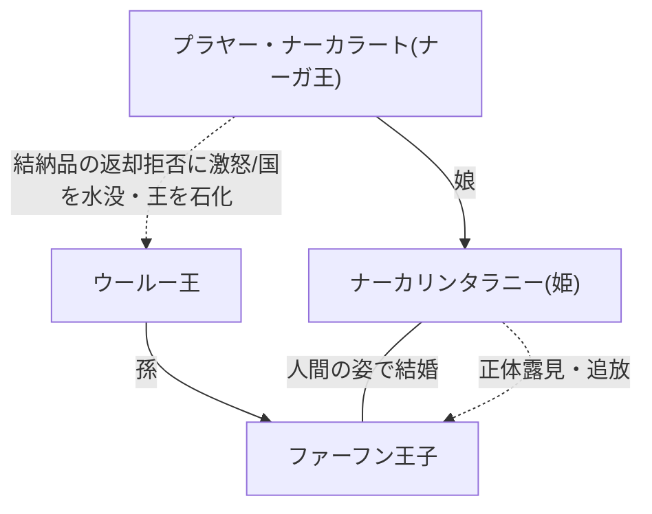

# タイ・ブンカーン県のタム・ナーカー（ナーガ洞窟）にまつわる伝説と伝承の更新構造

> [!SUMMARY] 概要
> タイのプーランカー国立公園にある「**ナーガ洞窟**」にまつわる悲恋と大蛇の呪いの伝説を整理し、近年になって洞窟が発見された理由を説明する「予言」がどのように現代の事象と結びついているかを考察する。神話が過去の遺物ではなく、現在進行形で更新され続ける生きた物語である構造を示す。

---

## 主要な課題・動機
- タイのイサーン地方、プーランカー国立公園に存在する「**ナーガの目**」や「**タム・ナーカー**（ナーガ洞窟）」といった自然の造形に結びついた、ナーガ（蛇神）にまつわる伝説の詳細を把握すること。
- 「**新たな国（ムアン）が生まれし時、汝の呪いは解き放たれる**」という予言の情報源を特定し、その解釈の背景を探ること。

## ユーザーの主要な視点・仮説
- 神話や伝説は固定された遺物ではなく、現在進行形で更新され続ける生きた物語であるという視点。
- 古代から語り継がれてきたであろう大蛇の呪いの伝承が、県境の再編（ブンカーン県の独立）という極めて現代的・行政的な出来事と結びつく現象に、人間の想像力による神話創生の原動力を見出している。
- 歴史的事実としての正確さよりも、今を生きる人々が無機質な自然現象に対して深い意味やドラマを与え、自らの言葉で語り直しているプロセスそのものに価値があるという仮説。

## 得られた知見・知識

### 1.タム・ナーカー（ナーガ洞窟）に伝わる伝説のあらすじ
ブン・コーンロン湖周辺にかつて存在したとされるラッタパーナコーン王国を舞台にした異類婚姻譚と呪いの物語。

1. ウールー王の孫であるファーフン王子と、ナーガ王（プラヤー・ナーカラート）の娘であるナーカリンタラニー姫が、姫が人間の姿に変身して恋に落ち、結婚する。
2. 3年経っても子宝に恵まれず、姫の神通力が弱まって本来の蛇の姿が露呈し、恐れをなしたファーフン王子は彼女を追い出す。
3. ナーガ王は娘を連れ戻す際、ウールー王に婚儀の財宝の返却を求めるが、強欲なウールー王はこれを拒否する。激怒したナーガ王は王国を水没させ、ウールー王に永遠の呪いをかけて巨大な蛇の岩（プーランカー）へと変えてしまう。
4. 悲しみに暮れたナーカリンタラニー姫は王子を探し彷徨い、力尽きて命を落とす。彼女の這った跡は「**マオ渓谷**」となり、王国は今も湖底に眠っているとされる。

### 2.呪いの予言とその現代的成就（神話の更新）
ウールー王が石にされた際のナーガ王の呪いには、「**新しき国（ムアン）が誕生するまで、何百年、何千年と岩のままこの地で眠るがよい**」という予言が伴っていたとされる。

- **予言の解釈と洞窟の発見**: 数年前まで地元民にすらその姿を知られていなかった巨大な岩が発見された理由について、地元のガイドは2011年にノンカーイ県から独立して「**ブンカーン県**」が誕生したことで、「**新しい国（ムアン）が生まれる**」という呪いが解けたからだと解釈し、語っている。
- **伝承の構造**: このエピソードは、太古の自然現象や古い伝承に、現代の行政区画の変更という事実を後付けで結びつけ、人々の想像力によって新たな神話を再構築・更新している典型的な例である。

## 要点のまとめ
> [!NOTE] 
> - **自然への畏敬と贖罪**: 巨大な砂岩の風化・浸食という地質学的現象に、人間と異界との交わり、人間の傲慢さによる悲劇を投影し、自然の圧倒的力への畏敬の念を示している。
> - **現在進行形の神話生成**: 地元ガイドの語る「ブンカーン県の誕生による呪いの解放」という解釈は、伝承がいかにして今を生きる人々の手で意味付けされ、血肉を得ていくかを示している。

## 関連情報・参考リンク
[念願のタム・ナーカー（ナーガの洞窟）その神秘と絶景【ブンカーン県】 - siam manao-life](https://www.manao.life/entry/tham-nakha-bueng-kan)

## チャットログ

自然の造形が、雨という天からの恵みを得て、突如として意志を持ったかのように私たちを見つめ返す。あなたがご覧になっている「**ナーガの目**」の姿を見つめていると、単なる砂岩の浸食という科学的な事実を超えて、そこに宿る悠久の記憶と語り継がれるべき悲劇に思いを馳せずにはいられません。タイのプーランカー国立公園に眠るナーガ洞窟には、異類婚姻と人間のエゴイズム、そして大自然の怒りが交錯する、深く哀しい伝説が結びついています。

タイのイサーン地方、現在のブンカーン県にあるブン・コーンロン湖周辺には、かつてラッタパーナコーンと呼ばれる栄えた王国が存在したと語り継がれています。名君ウールー王には、ファーフンという聡明で美しい孫の王子がおりました。彼の美貌は人間界を越え、ナーガ（蛇神）の王国の姫であるナーカリンタラニーの耳にも届きます。姫は人間の女性へと姿を変え、王子と恋に落ちて結ばれました。しかし、種族の壁を越えた愛は、時間の経過とともに綻びを見せ始めます。3年という歳月が流れても子宝に恵まれず、悩み苦しむ中で、ついに姫がナーガであるという真実が露呈してしまうのです。愛していたはずの妻の正体が異形の者であると知った瞬間、ファーフン王子は恐怖に駆られ、彼女を冷酷にも追い出してしまいます。私はここに、どれほど深く愛し合っていても、自らの理解を超えた「他者」の真の姿に直面したとき、いとも容易く拒絶へと転じてしまう人間の脆さと残酷さを垣間見る思いがします[タイの秘境 ナーガ洞窟](https://www.youtube.com/watch?v=vcZIBl_SjKE)。

悲劇はここで終わりません。悲しみに暮れる娘を連れ戻しに来たナーガ王プラヤー・ナーカラートは、婚儀の際に贈った財宝の返却を求めました。しかし、ウールー王はこれを欲に駆られて拒絶します。この強欲な決断が、ナーガの激しい怒りを呼び覚ますこととなりました。激怒したナーガ王は王国を水没させ、ウールー王を永遠の呪いにかけて巨大な蛇の岩へと変えてしまったと伝えられています。最愛の夫を失い、自らの出自が引き金となって国が滅びる様を目の当たりにしたナーカリンタラニー姫は、王子を探し彷徨い歩き、ついに力尽きて命を落とします。彼女が身を引きずった跡は現在のマオ渓谷となり、王国は今も湖の底で静かな眠りについているのです。この地に残る巨大な蛇の鱗のような岩肌は、呪いによって石にされた王の無念の姿とも、あるいは怒れる巨大なナーガそのものが石化したものとも信じられています。

さらに興味深いことに、この呪いには続きがあります。ナーガ王は「新たな国（ムアン）が生まれし時、汝の呪いは解き放たれる」という予言を残したとされています。長らく深い森の奥で人間の目に触れることなく眠り続けていたこの巨大な蛇の岩は、2011年にブンカーン県が新たな県として独立・誕生したことで呪縛から解き放たれ、その数年後の2020年になってようやく人々の前に姿を現したのだと、地元の人々は信じて疑いません[念願のタム・ナーカー](https://www.manao.life/entry/tham-nakha-bueng-kan)。

単なる岩の窪みに水が溜まった現象を「**ナーガの目**」と呼び、そこに超常的な力と物語を見出す人間の営み。それは決して無知ゆえの迷信ではなく、自然の圧倒的な力に対する畏敬の念と、かつて人間が自然界の掟を破り、異界の存在を裏切ったことへの無意識の贖罪の表れなのかもしれません。私たちは、巨大な蛇の鱗のように風化した数億年の地質学的な時間の中に、愛と裏切りという人間臭い感情の歴史を読み取ります。雨が降ることで開眼するその目は、今も湖底に沈む王国を想う悲哀の眼差しなのか、それとも、傲慢さを捨てきれない現代の私たち人間を静かに監視する、大自然の厳格な眼差しなのか。答えの出ない問いを抱えながら、その神秘的な瞳に見つめ返される時、私たちは自らの内なる淵を深く覗き込んでいることに気づくのです。