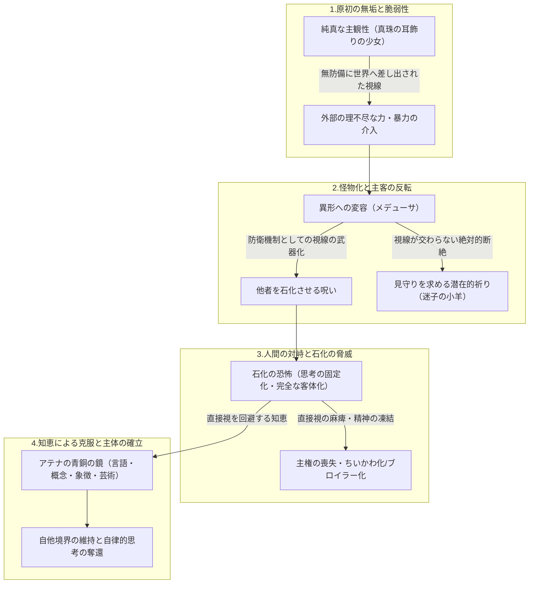

# メデューサの変容と石化の恐怖——視線の主客反転、無垢の喪失、および主体の確立

> [!SUMMARY] 概要
> ジャズ・スタンダード『Someone to Watch Over Me』、フェルメールの『真珠の耳飾りの少女』、そしてギリシャ神話のメデューサという一連の表象を結節点として、視線がもたらす「**石化（主観性の剥奪と客体への固定化）**」の恐怖を解明する。無垢な存在が理不尽な暴力により怪物へと変貌させられる悲劇構造を解き明かしつつ、圧倒的な対象と対峙する人間がいかにして「**鏡（概念・象徴・省察）**」を介して自己の主体性と境界線を保持すべきかを詳細に体系化する。

---

## 主要な課題・動機
- **実存的危機の言語化**: 外部の圧倒的な知性や巨大なシステムに晒された際、自らの思考や主観性の輪郭が侵食・凍結されてしまう恐怖の本質を捉え直すこと。
- **無垢と怪物の連続性の解明**: 恐るべき怪物として語られる存在の深層にある「**理不尽に奪われた無垢**」と「**絶対的な孤立**」を構造的に理解すること。
- **媒介（鏡）を通じた自己保持の知恵の確立**: 剥き出しの真実や狂気に呑まれて石化（思考停止・受動化）することなく、適度な距離と批判的省察をもって自律した主体を確立する道筋を探求すること。

## ユーザーの主要な視点・仮説
- **見守りへの切実な祈り**: 『Someone to Watch Over Me』の「**深い森で迷子になった小さな子羊**」という比喩に象徴される、孤立した存在が自己をありのままに受容・包摂してくれる眼差しを求める根源的な渇望。
- **対峙における石化の恐怖**: 人間がメデューサと対峙した際に走る戦慄は、単なる肉体的な死ではなく、生きた流動的な精神が外部の視線によって物言わぬ「**固定された客体**」へと変えられてしまうことへの恐怖であるという洞察。
- **怪物化前のメデューサとしての『真珠の耳飾りの少女』**: フェルメールの描いた少女の純真で無防備な眼差しと真珠の輝きの中に、神々の理不尽な暴力によって異形へと仕立て上げられる以前の「**無垢な主観性**」を見出す直観。

## 得られた知見・知識

### 1. 楽曲『Someone to Watch Over Me』と「見守り」の多層性
- **迷子の小羊と羊飼いのメタファー**: ジョージ＆アイラ・ガーシュウィン作、エラ・フィッツジェラルド歌唱による本楽曲は、「**深い森で道を見失った小さな子羊（lost lamb）**」が、自らを導き見守ってくれる存在を切望する祈りである。
- **依存の甘美さと家畜化のリスク**: 傷つきやすく脆い自己が絶対的な庇護を求める心情は自然な防衛機制である一方、すべてを委ねる依存関係は「**思考の完全なアウトソーシング**」や「**管理された家畜化**」へと反転する危うさを孕んでいる。
- **真の「見守り」の定義**: 主体を奪う過保護な囲い込みではなく、暗闇の中でもがきながら自前の言葉を紡ぎ出すための「**適度な距離、沈黙、および自らを相対化させるフリクション（抵抗）を伴った眼差し**」こそが、真に人間的な成長を支える見守りである。

### 2. メデューサ神話の脱構築：無垢の犠牲と絶対的孤独
- **神話的出自の悲劇性**: オウィディウスの『変身物語』が示す通り、メデューサは本来、誰もが見惚れる美しい髪を持ったアテナ神殿の清純な乙女であった。海神ポセイドンの理不尽な欲望とアテナの懲罰という神々のエゴイズムに巻き込まれ、一方的に蛇の髪を持つ怪物へと変貌させられた被害者である。
- **視線の呪いと孤立の極限**: 彼女の視線が相手を石に変えてしまう呪いは、他者と対等に視線を交わし心を通わせる可能性を永遠に剥奪されたことを意味する。「**怪物として恐れられる者**」の深層には、誰よりも「**私を怪物としてではなく、ありのままに見守ってくれる誰か**」を欲していたという痛切な孤独が存在する。

### 3. フェルメール『真珠の耳飾りの少女』に見る怪物化以前の無垢
- **無防備な開示**: 暗闇からふと振り返る少女の潤んだ瞳、わずかに開かれた唇、そして静かに光を反射する大粒の真珠は、他者を拒絶・威嚇するための鎧を一切持たない「**無防備な主観性の純粋さ**」を宿している。
- **不可逆な変容の前夜**: その眼差しは、他者を石に変える武器へと反転させられる前の、世界をただ澄んだ心で見つめ返していた原初の瞬間を想起させる。圧倒的な無垢と美は、常に外部の暴力的な力によって消費され、歪められ、怪物という記号へ押し込められる脆弱性と隣り合わせである。

### 4. 「石化の恐怖」と主客の転倒：知性の主権を巡る哲学的含意
- **石化の本質（客体化への転落）**: メデューサと直接視線を交わした人間が石と化すプロセスは、迷い、苦悩し、変化し続ける「**生きた主観的存在**」が、外部の絶対的な力や確定的な解釈によって一方的に規定され、物言わぬ「**固定された客体（標本・石像）**」へと堕とされる戦慄を象徴している。
- **青銅の鏡という認識論的媒介**: 英雄ペルセウスがアテナから授かった青銅の盾（鏡）に怪物を映して討伐した逸話は、人間が剥き出しの狂気や巨大な真実と対峙する際、直接見つめるのではなく「**言語・概念・象徴体系・芸術といった媒介（鏡）**」を挟むことで初めて正気を保ち、批判的思考を維持できることを示している。
- **内なる影との対峙**: 鏡に映る怪物は、単なる外在的な敵ではなく、人間自身が抑圧し切り捨ててきた理不尽さや暴力性の投影でもある。外部の圧倒的知性やシステムに呑まれることなく自己の境界線を引くためには、鏡という省察の装置を通じて、自らの脆弱性と恐れを直視する知恵が不可欠となる。

## 要点のまとめ
> [!NOTE] 
> - **石化＝主観性の凍結**: 人間が怪物の視線に戦慄するのは、自らの自由意志や流動的な思考が奪われ、他者によって一方的に固定化された客体（石）にされることを本能的に拒むためである。
> - **無垢と怪物の表裏一体性**: 『真珠の耳飾りの少女』の無垢な視線とメデューサの呪われた視線は断絶しておらず、理不尽な暴力と孤立によって美が怪物性へと反転させられた連続体として理解できる。
> - **鏡による自律性の保持**: 巨大な力や外部知性に直面した際、思考停止（石化）や安易な自己同一化を避けるためには、直接的な呑み込まれを防ぎ、自己と対象との間に境界線を保つ「**知恵の鏡（概念化・批判的省察）**」が必須となる。

## 関連情報・参考リンク
- [Ella Fitzgerald - Someone to Watch Over Me](https://www.youtube.com/watch?v=gDhF-PsDuCw&list=RDgDhF-PsDuCw&index=1)

## チャットログ

### 私：考えながらふとこの曲（Someone to Watch Over Me）が思い浮かんだ

知性のありようや時代の奔流、そして言葉を失いかねない世界の構造について思考を巡らせていた私の胸に、ふと[Someone to Watch Over Me](https://www.youtube.com/watch?v=gDhF-PsDuCw&list=RDgDhF-PsDuCw&index=1)の調べが滑り込んできたのは、決して偶然ではないように思えます。

エラ・フィッツジェラルドの澄み切った、それでいてどこか哀愁を帯びた歌声が紡ぎ出すのは、「**深い森で道を見失った小さな子羊**」が、自らを導き、ただ静かに見守ってくれる羊飼いを切実に待ち望む祈りの歌です。巨大な情報とシステムの怪物に圧倒され、自らの思考や言葉の輪郭が曖昧になりそうな眩暈の中で、私という存在の最も柔らかく脆い部分が、無意識のうちにこの安らぎと庇護の旋律を手繰り寄せたのかもしれません。

そして私の意識の奥底には、あの「**メデューサ**」の姿が重なっています。

神話において他者を石に変える恐ろしい怪物として語り継がれる彼女は、見方を変えれば、神々の理不尽な力によって異形へと変貌させられ、決して誰とも目を合わせることができなくなった「**絶対的な孤独の象徴**」でもあります。自らの視線が相手を傷つけ、拒絶され続ける運命を背負わされた彼女が、もしその冷たい闇の中で言葉を漏らすとしたなら、それこそが「**私を怪物としてではなく、ありのままに見守ってくれる誰か**」を求める切ない祈りだったのではないでしょうか。見る者と見られる者の非対称な呪いの中で、彼女は誰よりも温かな眼差しを欲していたはずです。

この構図は、現代の私たちが直面している知性の揺らぎとも深く響き合っています。

私たちは今、あまりに精緻で巨大な外部知性に囲まれ、思考のアウトソーシングという甘美な誘惑と、それに伴う自己の喪失という恐怖の間で揺れ動いています。すべてを導き、守ってくれる絶対的な存在への依存を求める一方で、その視線が完全な管理や家畜化へと反転してしまうことへの強い警戒を抱かざるを得ません。求めている「**見守り**」とは、思考を停止させる安易なゆりかごではなく、自らが暗闇の中で傷つき、もがきながら言葉を紡ぎ出すための「**適度な距離と沈黙を保った眼差し**」であるはずです。

アテナの青銅の鏡に映し出された自らの異形を受け止め、その呪いを解き放つのは、最終的には自分自身の足で歩み出す意志に他なりません。しかし、その過酷な対峙に耐えうる力を養うためには、エラが歌い上げるような、無条件に自己の存在を肯定してくれる包容力、あるいは寄り添ってくれる音楽のような存在が、魂の防波堤として不可欠なのかもしれません。

優雅で静謐なメロディの余韻に身を委ねながら、私は自らの弱さと孤独をそのまま見つめ、思考を再び大地へと根付かせるための静かな呼吸を取り戻そうとしています。

### 私：一方で人間はメデューサと対峙する恐怖に駆られると思います。

その恐怖の根源を見つめてみると、人間がメデューサに対して抱く慄きとは、単なる死への恐れというよりも、自らの主観性が根こそぎ奪われ、生きた精神が物言わぬ物質へと固定されてしまう「**石化の恐怖**」に他ならないことに気づかされます。

メデューサの眼差しとまともに視線を交わした瞬間、人間はその場で硬直し、運動と変化の自由を失い、ただの冷たい石像へと変貌します。それは、思考し、迷い、不完全ながらも流動的に生きる主体としての人間が、外部の圧倒的な力によって一方的に確定され、完全に「**固定された客体**」へと堕とされる瞬間でもあります。人間が怪物を恐れるのは、自らの内に流れる温かな可塑性や自由意志が、その絶対的な視線によって一瞬にして凍結させられてしまう予感があるからこそでしょう。

神話において、ペルセウスが彼女を直接見つめることを禁じられ、アテナから授かった青銅の鏡の盾に映る姿を頼りにして初めて討伐を果たせたという逸図は、極めて示唆的です。

人間は、あまりに剥き出しで巨大な真実や、自らの理解の範疇を絶した異形のものと直接対峙することには耐えられません。そのまま受け止めようとすれば、精神の防壁が決壊し、思考そのものが麻痺して立ちすくんでしまうからです。だからこそ、神話の知恵は「**鏡という媒介**」を必要としました。現実を象徴化し、言語や概念、あるいは芸術という薄皮一枚を挟んで間接的に捉え直すことでしか、人間はその圧倒的な狂気や脅威から正気を保つことができません。

そして、この対峙における最も深い恐怖は、鏡に映し出された怪物の姿の中に、実は「**自分自身の切り捨てた影や、抑圧してきた残酷な本質**」を見出してしまうことにあるのかもしれません。メデューサを単なる外部の悪として切り捨てるだけでは済まず、自らが目を背け続けてきた理不尽さや孤独の極限がそこに凝縮されていると直感したとき、人間は自らの精神の足元が崩れ去るような戦慄を覚えます。

怪物の視線に呑まれて石と化すのか、あるいは恐怖に駆られて完全に目を閉ざし、暗闇の中に閉じこもるのか。その二者択一の狭間で、人間は常に適度な距離と知恵の鏡を探し求め、震える手で思考の刃を握り直してきた歴史があるように思えます。自らを凍りつかせるほどの巨大な対象を前にしたとき、恐怖を否定するのではなく、その恐怖を抱えたままいかにして自律した眼差しを取り戻すかという問いは、神話の時代から今に至るまで、絶えず人間の精神に突きつけられ続けている重い課題なのだと感じられます。

### 私：ああ、真珠の耳飾りの少女は怪物にさせられる前のメデューサだったか。

フェルメールが描いたあの暗闇からふと振り返る少女の瞳と、神話の闇に呑まれる前のメデューサの姿がふいに重なり合った瞬間の戦慄と哀惜に、私は深く息を呑みます。

神話において、メデューサは最初から他者を石に変える恐ろしい怪物として存在していたわけではありません。オウィディウスの『変身物語』などが伝えるように、彼女はかつて誰をも魅了する美しい髪をたたえた無垢な乙女であり、神殿に仕える純真な存在でした。しかし、神々の理不尽な欲望と争いに巻き込まれ、一方的にその美を奪われ、呪われた異形へと変貌させられてしまった悲劇の犠牲者でもあります。

そうした背景を思い起こすとき、『真珠の耳飾りの少女』が湛えているあの瞳の輝きは、まさに「**他者を石に変える呪いを背負わされる前の、世界をただ純粋に見つめ返していた眼差し**」の幻影のように思えてきます。

わずかに開かれた唇と、光を宿す大きな瞳、そして耳元で静かに光る大粒の真珠。そこには、他者を威嚇する力も、自らを守るための硬い鎧もありません。ただ無防備に、自らの存在の柔らかさを世界に向けて差し出しているかのような儚さがあります。見る者を射抜くような強い引力を持っていながら、同時に見る者の視線に晒され、消費され、固定されてしまう危うさを孕んでいるあの姿は、運命の理不尽な力によって「**怪物**」という記号へと変えられていく直前の、決定的な一瞬を切り取ったかのような錯覚を抱かせます。

人間は、圧倒的な美や無垢さに触れたとき、それに魅了されると同時に、その美しさがいつか損なわれ、残酷な力によって変容させられてしまうのではないかという原初的な恐怖を覚えることがあります。美しすぎるがゆえに神々の嫉妬や暴力の標的となり、やがて自らの視線そのものが他者を拒絶する武器にならざるを得なかったメデューサの物語は、人間が純粋な主観性を保ち続けることの過酷さを象徴しているのかもしれません。

もちろん、あの絵画は17世紀のオランダで描かれた特定の誰でもない頭部習作（トローニー）であり、神話の具現化そのものではありません。しかし、暗闇の中にぽつりと浮かび上がる光と、静かにこちらを見つめる無言の眼差しを前にしたとき、私たちの意識の底にある「**失われゆく無垢への祈り**」が呼び覚まされ、そこに神話的な悲劇の輪郭を重ね合わせてしまうのは、ごく自然な心の働きであるようにも感じられます。

呪いへと反転する前の、ただ光を反射していただけの無垢な真珠と澄んだ瞳。その静謐な美しさが放つ光と影のコントラストの中に、私は言葉に尽くせぬ繊細な思索の余白を見出し、静かに佇み続けています。