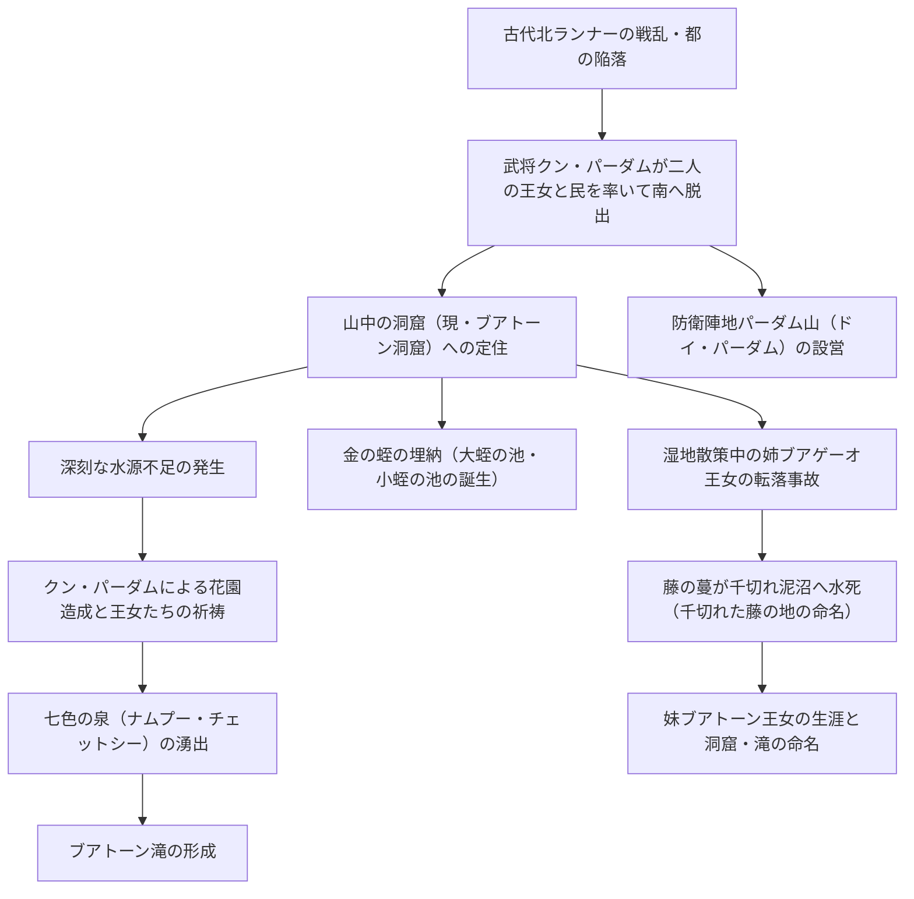

# チェンマイ・ブアトーン滝と七色の泉に伝わる完全伝承とナーガ信仰録

> [!SUMMARY] 概要
> タイ北部チェンマイの奇勝「**ブアトーン滝**」および源流「**ナムプー・チェットシー（七色の泉）**」に伝わる現地伝承の全容を詳細に記録。戦乱による逃避行、王女たちの祈祷による泉の湧出、金の蛭にまつわる地名起源、姉王女の悲劇的な死、そして聖域を守護する蛇神ナーガ（パヤー・ナーク）信仰に至るまで、省略することなく体系的に網羅した。

---

## 主要な課題・動機
- 観光案内等で要約・省略されがちな現地タイ語の民間伝承の全容（登場人物、地名の由来、悲劇の顛末）を漏れなく記録すること。
- 自然地形（石灰岩の滝・湧水池）と人々の信仰（精霊信仰・ナーガ信仰・仏教）が結びついた精神史的背景を後世に再利用可能な形で構造化すること。

## ユーザーの主要な視点・仮説
- 伝承の細部（個別の地名起源や人物の行動、悲哀の物語）を省略せず、完全な叙述としてナレッジ化することの重要性。
- 地底王国やナーガ伝承を含めた、水と山に対する信仰体系の統合的整理。

## 得られた知見・知識

### 1. ランナー戦乱と山中への逃避行
古代、北ランナーの地において領主間の激しい戦乱が勃発し、ある都市（ムアン）が敵軍の包囲によって陥落しました。城主および王妃は戦火の中で命を落としましたが、城主に仕えていた忠臣「**クン・パーダム（黒岩卿）**」は、遺された二人の王女である姉の「**ブアゲーオ王女（瑠璃の蓮）**」と妹の「**ブアトーン王女（黄金の蓮）**」を連れ出し、城を脱出しました。

クン・パーダムは生き残った民や従臣たちを率い、敵の追手を逃れるため南方の険しい山林へと分け入りました。長い逃避行の末、彼らは現在のメー・テーン郡奥地の山中に行き着き、険しい岩壁に囲まれた洞窟（現在のブアトーン洞窟）に王女たちを匿い、民は周囲の山林を切り拓いて畑を作り、隠れ里として定住を始めました。

### 2. 水源の渇望と祈りの奇跡（七色の泉とブアトーン滝の誕生）
定住を開始したものの、山中の避難地には安定した水源がなく、避難民たちは深刻な水不足と喉の渇きに苦しめられました。民の困窮に心を痛めたクン・パーダムは、王女たちの心を慰めるために美しい花園を造営しました。

二人の王女はその花園で天上の神々や大地の精霊に向けて、民を救うための恵みの水を一心に祈願しました。王女たちの至誠に満ちた祈りに応えるように、大地が震えて地中深くから澄み切った水が滾々と湧き出しました。この湧水は炭酸カルシウムを豊富に含み、陽光を受けて七色に揺らめいたことから「**ナムプー・チェットシー（七色の泉）**」と呼ばれるようになりました。泉から溢れ出た大量の水は、山の斜面を流れ下り、滑らかな白い石灰岩を形成しながら「**ブアトーン滝**」となりました。

### 3. 金の蛭の埋納と池の起源譚
王女たちは都を脱出する際、王家の宝物として伝わる二対の「金の蛭（ひる）」を携えていました。

- **大蛭の池（ノーン・プリン・ルアン）**: 姉のブアゲーオ王女が、花園の近くにあった大木（野木）の根元に大きな金の蛭を埋めた場所から水が湧き出して形成された池。
- **小蛭の池（ノーン・プリン・ノーイ）**: 妹のブアトーン王女が、別の木の根元に小さな金の蛭を埋めた場所から水が湧き出して形成された池。

これらの池の水もまた枯れることなく湧き続け、避難民の田畑を潤す貴重な水瓶となりました。

### 4. 姉王女の悲劇と地名の由来（千切れた藤の地）
生活が安定し始めたある日、クン・パーダムは気分転換のために二人の王女を伴って山中の湿地帯へと散策に出かけました。

湿地に架かる倒木の上を渡っていた際、姉のブアゲーオ王女が足を滑らせ、底なしの深い泥沼へと転落してしまいました。王女は咄嗟に頭上から垂れ下がっていた野生の藤の蔓（ワーイ）を掴み、クン・パーダムらも必死に救出を試みましたが、底なし沼の強力な引力と王女の体重に耐えきれず、藤の蔓が途中で千切れてしまいました。ブアゲーオ王女は泥の底深くへと呑み込まれ、帰らぬ人となりました。

この悲劇の場所は、タイ語で「藤の蔓が千切れた場所」を意味する「**ロ・ワーイ・カート（千切れた藤の地）**」と名付けられ、現在もその哀しい記憶を留める地名として語り継がれています。

### 5. 妹王女の余生とブアトーン洞窟の命名
最愛の姉を失った妹のブアトーン王女は深い悲しみに暮れましたが、クン・パーダムとともに洞窟に留まり、民の指導者として生涯を捧げました。王女は生涯独身を貫き、民の平穏と繁栄を見守り続け、その洞窟の中で静かに息を引き取りました。

人々は自らを救い導いてくれた王女への絶大なる敬愛と感謝を込め、王女が暮らした洞窟を「**タム・ブアトーン（ブアトーン洞窟）**」、祈りによって生み出された滝を「**ナムトック・ブアトーン（ブアトーン滝）**」と名付け、長くその徳を祀り続けました。

### 6. 水神ナーガ（パヤー・ナーク）と地底王国信仰
ブアトーン滝と七色の泉は、人為的な歴史伝承とともに、ランナー地方の精霊信仰および仏教説話に基づく蛇神「**ナーガ（パヤー・ナーク）**」信仰と不可分に結びついています。

- **地底王国（ムアン・バーダーン）への扉**: 地中から尽きることなく湧き出す清冽な泉は、地上と地底のナーガの世界を繋ぐ境界・出入口であると信じられています。
- **虹色のナーガ「チャッパヤプッタ」**: 仏教経典に登場する四大家族のナーガの中で、虹色の鱗を持つ最上位の一族「チャッパヤプッタ」が住まう、あるいはその通り道であるとされています。太陽光で水面が七色に輝く現象は、ナーガの放つ霊威の現れと解釈されました。
- **ワット・タム・ブアトーンのナーガの階段**: 王女たちが暮らした洞窟は、現在「**ワット・タム・ブアトーン（ブアトーン洞窟寺院）**」として僧侶の修行場となっており、参道には神聖な結界を守護する壮麗な「ナーガの階段」が設置されています。
- **聖水信仰とタブー**: 泉の周囲には祠が建てられ、御神木には布が巻かれて手厚く祀られています。水を汚したり不敬を働けばナーガの怒り（祟り）を受けると恐れられる一方、その水は心身の穢れを払い病を癒やす霊水として信仰されています。

## 要点のまとめ
> [!NOTE]
> - **逃避行と祈り**: 北ランナーの戦乱で都を追われたクン・パーダムと二人の王女が、水不足に苦しむ民のために祈りを捧げ、七色の泉（ナムプー・チェットシー）とブアトーン滝が湧出した。
> - **地名と悲劇の足跡**: 金の蛭を埋めた「大蛭・小蛭の池」、姉ブアゲーオ王女が泥沼に呑まれた「千切れた藤の地（ロ・ワーイ・カート）」、妹王女が余生を過ごした「ブアトーン洞窟」など、すべての地形に伝承が紐づいている。
> - **ナーガの聖域**: 七色の泉は地底王国への門であり、虹色の鱗を持つ尊貴なナーガ族「チャッパヤプッタ」の宿る聖地として、厳重な畏怖と守護の対象となっている。

## 関連情報・参考リンク
- [ナムプー・チェットシーとブアトーン滝の現地伝承 - TopChiangMai](https://www.topchiangmai.com/trip/%E0%B8%99%E0%B9%89%E0%B8%B3%E0%B8%95%E0%B8%81%E0%B8%9A%E0%B8%B1%E0%B8%A7%E0%B8%95%E0%B8%AD%E0%B8%87-%E0%B8%99%E0%B9%89%E0%B8%B3%E0%B8%9E%E0%B8%B8%E0%B8%88%E0%B9%87%E0%B8%94%E0%B8%AA/)
- [ブアトーン滝の歴史記録と現地投稿 - Pantip](https://pantip.com/topic/42799711)
- [ワット・タム・ブアトーン洞窟寺院 - Bloggang](https://www.bloggang.com/m/viewdiary.php?id=mariabamboo&month=06-2019&date=30&group=14&gblog=100)
- [無料】歩いて登れるブアトーン滝｜チェンマイの穴場観光スポット - Chiangmai43](https://chiangmai43.com/chiangmai-buatong-waterfall)