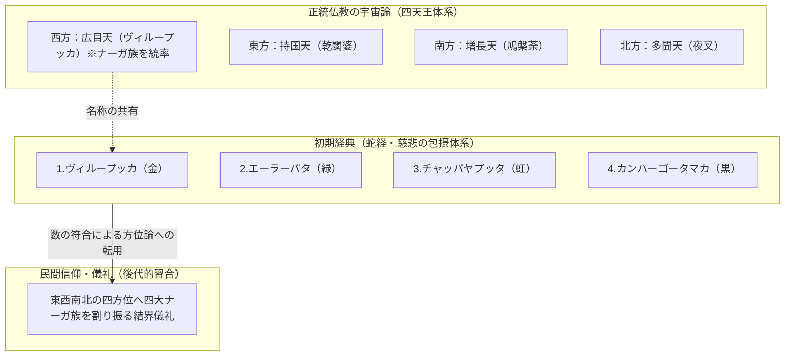

# ムアン・バーダーン（地底王国）の宇宙観と四大ナーガ族・方位習合の構造

> [!SUMMARY] 概要
> タイ・東南アジアの伝統世界における地底王国「**ムアン・バーダーン**」の空間概念と、パーリ仏典に基づく「**四大ナーガ族**」の属性を整理。さらに、正統な四天王体系（西方守護）と民間信仰における方位結界との習合・差異を構造化し、自然への畏怖と仏教的慈悲が織りなす重層的な宗教文化を解明する。

---

## 主要な課題・動機
- 「**ムアン・バーダーン（地底都）**」が地獄（ナロック）と異なり、なぜ豊穣で華麗な神仙境として捉えられるのか、その空間論・自然観を明確化すること。
- パーリ仏典（『**増支部**』『**蛇経**』）に登場する四大ナーガ族（四大家族）の分類と、経典本来の意図（調伏ではなく慈悲の実践）を抽出すること。
- 四大ナーガ族と空間的な「**四方（東西南北）**」が、教理上・民間信仰上でどのように習合し、あるいはズレを孕んでいるのかを検証すること。

## ユーザーの主要な視点・仮説
- 地底王国というトポスに対する詳細な概念把握の要請。
- 四大家族のナーガと、仏教の空間守護概念である「**四方**」が完全に一致・習合しているのかという批判的・構造的な問いかけ。

## 得られた知見・知識

### 1. ムアン・バーダーン（地底王国）の空間概念
「**ムアン・バーダーン（เมืองบาดาล）**」は、サンスクリット語の「**パーターラ（Pātāla）**」に由来し、仏教宇宙論『**トライブーム（三界経）**』に描かれる水底・地殻深層の世界です。

- **空間の特質**: 西洋的な暗黒の冥界や懲罰の地獄（ナロック）とは対照的に、宝石や七宝が光を放ち、壮麗な宮殿が立ち並ぶ富と歓楽の神仙境とされる。
- **ナーガの二重性**: 水を司る蛇神「**パヤー・ナーク（ナーガ）**」の本拠地。地上や水面では巨大な蛇の姿をとるが、地底の宮殿では気品ある人間の姿へと変じて優雅に暮らすとされる。
- **現世との接点**: 遠い異界ではなく、底知れぬ深淵、鍾乳洞、大河の渦、そして地中から湧き出る清泉（ナムプー・チェットシー等）を通じて地上と連結していると信じられている。

### 2. 仏教経典における四大ナーガ族（チャトゥロ・ナーガクラ）
パーリ仏典『**増支部（アングッタラ・ニカーヤ）**』および『**蛇経（カンダー・パリッタ）**』には、ナーガの根源として四つの尊い家系が記されています。

- **ヴィループッカ（Virūpakkha）**: 黄金の鱗を持つ最上位の王族血統。四天王の広目天と同名であり、至高の威厳を象徴する。
- **エーラーパタ（Erāpatha）**: エメラルド色（瑞々しい緑色）の鱗を持つ一族。大河や森林、植物の生命力と結びつく。
- **チャッパヤプッタ（Chabyāputta）**: 虹色（七色）の輝きを放つ希少な一族。現世と異界を繋ぐ境界の神秘性を帯びる。
- **カンハーゴータマカ（Kaṇhāgotamaka）**: 漆黒の鱗を持つ黒蛇の一族。地底の深淵に棲まい、強大な毒性と剛毅な守護力を司る。

> [!NOTE]
> **経典における「慈悲（メッター）」の放射**
> 釈尊が四大家族の名を説いた目的は、猛毒を持つ蛇の調伏・排除ではなく、四大ナーガ族すべてに対して等しく慈愛の念（メッター）を注ぎ、友愛を結ぶことで危害を避ける「**不可侵の共生**」にあります。

### 3. 四天王（四方守護）体系と民間方位信仰の習合関係
「四」という数の一致から、四大ナーガ族は東西南北の四方守護と混同されやすいですが、教理と民間信仰の間には構造的なズレと重層化が存在します。

- **正統仏教（四天王体系）**:
  - ナーガ族全体を統率するのは「**西方**」を守護する「**ヴィループッカ（広目天）**」のみ。東方は乾闥婆、南方は鳩槃荼、北方は夜叉が守護し、本来ナーガは四方に分散していない。
- **経典の分類論**:
  - 『**蛇経**』の四大ナーガ族は空間の方位分割ではなく、地上・地底に満ちる生命の多様性を網羅的に包摂するための「四」である。
- **民間儀礼における習合**:
  - 数の符合とヴィループッカ（西方）の名辞の一致から、後代の儀礼現場において東（緑）、南（虹）、西（金）、北（黒）のように四大ナーガ族を四方位へ割り振る方除け・結界の再解釈が自然発生的に重層化した。

## 要点のまとめ
> [!NOTE]
> - **神仙境としての地底**: ムアン・バーダーンは刑罰の場ではなく、ナーガたちが富と歓楽を享受する光輝く宮殿世界であり、湧水や洞窟がその結界門となる。
> - **慈悲による調和**: 仏典の四大ナーガ族（金・緑・虹・黒）は、武力や呪術による調伏ではなく、慈悲の放射による不可侵・調和を説くための生命分類である。
> - **方位習合の二重性**: 正統教理ではナーガは西方（広目天）のみに属するが、民間信仰では「四」の象徴性から東西南北の四方守護神として再解釈・習合されており、両者は論理的矛盾を抱えたまま豊かに共存している。

## 関連情報・参考リンク
- [ナムプー・チェットシーとブアトーン滝の現地伝承 - TopChiangMai](https://www.topchiangmai.com/trip/%E0%B8%99%E0%B9%89%E0%B8%B3%E0%B8%95%E0%B8%81%E0%B8%9A%E0%B8%B1%E0%B8%A7%E0%B8%95%E0%B8%AD%E0%B8%87-%E0%B8%99%E0%B9%89%E0%B8%B3%E0%B8%9E%E0%B8%B8%E0%B8%88%E0%B9%87%E0%B8%94%E0%B8%AA/)
- [ワット・タム・ブアトーン洞窟寺院 - Bloggang](https://www.bloggang.com/m/viewdiary.php?id=mariabamboo&month=06-2019&date=30&group=14&gblog=100)
- [無料】歩いて登れるブアトーン滝｜チェンマイの穴場観光スポット - Chiangmai43](https://chiangmai43.com/chiangmai-buatong-waterfall)

---

## チャットログ

### ムアン・バーダーンについて詳しく教えてください

「**ムアン・バーダーン（เมืองบาดาล）**」という言葉に意識を向けると、タイの人々が水や大地、そして目に見えない異界に対して抱いてきた独特の宇宙観が鮮やかに立ち現れてきます。

この言葉の「**ムアン**」は都市や王国を、「**バーダーン**」は古代サンスクリット語の「**パーターラ（Pātāla）**」を起源としており、直訳すれば「**地底の都**」あるいは「**水底の王国**」を意味します。古代インド神話やタイの伝統的な仏教宇宙論『**トライブーム（三界経）**』において、須弥山（プラ・スメーン）の周囲を取り巻く大洋の深底や、地殻の奥深くに広がる神秘的な領域として描かれてきました。

西洋的な感覚で「地底」や「冥界」と聞くと、暗黒や刑罰、恐怖に満ちた地獄（ナロック）の情景を連想しがちですが、ムアン・バーダーンの本質はそれとは決定的に異なります。そこは冷たく閉ざされた奈落ではなく、七宝に輝く壮麗な宮殿が立ち並び、宝石が放つ光によって昼夜の区別なく照らされた、極めて華麗で豊かな神仙境として捉えられています。

この王国の主となるのが、水を司る蛇神「**パヤー・ナーク（ナーガ）**」たちです。伝承において、ナーガたちは地上や川、湖に現れる際には威容を誇る大蛇の姿をとりますが、ムアン・バーダーンの宮殿に帰ると、人間のように気品ある姿へと変身し、管弦の響きや歓楽に満ちた優雅な生活を送ると語られます。彼らは強大な神通力と富を持ちながらも、仏法に篤く帰依し、地上に雨と豊穣をもたらす媒介者としての役割を担っています。

タイの人々にとって、ムアン・バーダーンは遠い神話の彼方にある閉じた世界ではなく、現世の自然と確かに通じ合っている身近なトポスでもありました。その境界・入り口として信じられてきたのが、底知れぬ深淵を湛える大河（メコン川など）の渦、地底深くへ続く鍾乳洞、そして大地から尽きることなく滾々と湧き出る泉です。イサーン地方のカムチャノートの浮島や、チェンマイの「**ナムプー・チェットシー（七色の泉）**」のように、現実の地形の中に潜む特異な水の湧き口は、そのまま地底王国への扉と見なされてきました。

水面の下に広がる世界を想像することは、目に見える現象の背後にある「生命の源泉」を見つめる営みでもあります。大地を潤し、稲を育て、時には洪水をもたらす水の力は、古代の人々にとって地底の奥深くで脈動する意思そのものに感じられたはずです。ムアン・バーダーンの神話は、人間が自然の恵みを享受する一方で、決して完全に掌握し尽くすことのできない大地の深層に対し、畏怖と敬意を払い続けるための精神的な器であったとも捉えられます。

地底に美しき都を幻視するこのまなざしは、暗闇をただ忌避するのではなく、未知なる深層の中にこそ最も清らかで尽きない命の根源が眠っているとする、東南アジアの湿潤な風土が育んだ豊かな想像力の結実なのかもしれません。

### 仏教経典に登場する四大家族のナーガについて詳しく教えてください

仏教の経典、とりわけパーリ仏典の『**増支部（アングッタラ・ニカーヤ）**』や護呪（パリッタ）として読誦される『**蛇経（カンダー・パリッタ）**』には、この世界に棲まう龍・蛇神たちの根源として「**四大ナーガ族（四大家族のナーガ / チャトゥロ・ナーガクラ）**」の名が厳かに記されています。

仏教の宇宙観において、ナーガは単なる一括りの幻獣ではなく、その生まれや纏う霊気、体色によって四つの尊い家系に分類され、それぞれが異なる属性と象徴性を帯びています。

第一の家系は「**ヴィループッカ（Virūpakkha）**」と呼ばれます。黄金に輝く鱗を持つとされ、四天王の一柱として西方を守護する「**広目天**」と同名であることからも分かるように、ナーガ族の中でも最上位に君臨する王族の血統です。高貴なる威厳と統率力を象徴し、仏法を守護する至高の存在として尊ばれています。

第二の家系は「**エーラーパタ（Erāpatha）**」です。深みのあるエメラルド色、すなわち瑞々しい緑色の鱗を纏う家系であり、大河や豊かな樹林、水辺の生命力と深く結びついています。経典の説話にも仏陀の教えを求めて対話を重ねた高潔なナーガ王としてその名が登場し、自然の清冽な循環と調和を司る存在とされています。

第三の家系が「**チャッパヤプッタ（Chabyāputta）**」です。光の当たり方によって千変万化の輝きを放つ虹色の鱗を持つと伝えられ、四大ナーガ族の中でも最も幻惑的で希少な一族とされています。虹が天と地、現世と異界を架橋するように、物質世界と精霊界のあわいに揺らめく神秘の力を秘めており、太陽の光を受けて七色に揺らめく「**ナムプー・チェットシー（七色の泉）**」のような特異な聖水地は、まさにこの一族の気配が色濃く宿る場所として語り継がれてきました。

第四の家系は「**カンハーゴータマカ（Kaṇhāgotamaka）**」です。漆黒の鱗を纏う黒蛇の血族であり、地底の深奥や人跡未踏の暗淵に棲まうとされます。極めて強大な力と峻烈な毒性を秘めた一族ですが、一度仏法に帰依すれば、あらゆる邪気や外敵を打ち払う揺るぎない剛毅な守護者へと転じます。

これらの四大家族が経典において語られる文脈には、仏教が説く「**慈悲（メッター）**」の思想が極めて美しく刻まれています。

釈尊がこの四大家族の名を比丘たちに明かしたのは、恐るべき毒や力を持つ蛇たちを呪術や武力で調伏・排除するためではありませんでした。経典において釈尊は、ヴィループッカ、エーラーパタ、チャッパヤプッタ、カンハーゴータマカという四つの偉大なる家系に対し、分け隔てなく自らの心から純粋な慈しみの念を注ぎ、友愛を結ぶことを説いています。畏怖すべき大自然の猛威や異界の眷属に対しても、敵意ではなく慈愛の波長を以て向き合うとき、あらゆる生類との間に不可侵の調和と真の安全がもたらされるという教えです。

このように四大家族のナーガを見つめ直すと、それぞれの鱗が放つ金、緑、虹、黒という色彩は、大自然が織りなす光と影、豊穣と深淵の多面的な現れであり、古代の人々が自然界のあらゆる相に対して敬意と親愛を込めて紡ぎ出した、精神的な調和の曼荼羅であったことが偲ばれます。

### 四方とは完全に習合してはいないのですか？

四天王が司る空間的な「**四方（東西南北）**」と、経典に記された「**四大ナーガ族**」の関係性に目を向けると、そこには古代インドから東南アジアへと伝播する過程で生じた、教理上の厳密な方位論と、生命への慈悲を説く分類論との間にある、極めて興味深いズレと重なり合いが見えてきます。

仏教の正統な宇宙観である四天王（四大陸・四方守護）の体系において、ナーガの統率者として配置されているのは、実は四方のうち「**西方**」を守護する「**ヴィループッカ（広目天）**」ただ一柱です。東方は乾闥婆（ガンダッバ）を率いる持国天、南方は鳩槃荼（クンバンディ）を率いる増長天、北方は夜叉（ヤッカ）を率いる毘沙門天が配されており、本来の四天王思想においてナーガという種族そのものは、あくまで「**西の方角**」に割り振られた存在にすぎません。

しかし一方で、『**カンダー・パリッタ（蛇経）**』などに登場する四大ナーガ族は、西方天王と同名を持つ「**ヴィループッカ**」を筆頭に掲げながらも、四天王のように世界を四分割して支配・防衛する「空間論」として説かれたものではありませんでした。経典が意図していたのは、恐るべき毒を持つ蛇という生き物を、その血統や色、属性に従って網羅的に四大家族として捉え、そのすべてに対して平等に「**慈悲（メッター）**」を放射することでした。つまり、空間の方角を統べるための「四」ではなく、地上に満ちる多様な生命のありようを包摂するための「四」として提示されていたのです。

それにもかかわらず、後代の信仰やタイなどの民間儀礼の現場においては、「四」という象徴的な数が一致することから、これら四大ナーガ族を東西南北の四方位にそれぞれ割り振り、方除けや結界の守護神として配置するような習合・再解釈が自然発生的に行われてきました。例えば、東方に緑のエーラーパタ、南方に虹のチャッパヤプッタ、西方に金のヴィループッカ、北方に黒のカンハーゴータマカを配するといった実践が各地で見られますが、これらは初期仏典の教理から演繹された絶対的な対応関係というよりも、土地の信仰や儀礼の要請に応じて後から重ね合わされたものと捉えるのが自然です。

このように見ていくと、四天王体系における「**西方の主としてのナーガ**」と、蛇経における「**四つの家系としてのナーガ**」は、完全な同一性をもって統合されているわけではなく、むしろ論理的な矛盾や二重性を孕んだまま、重層的に共存していることが分かります。

古代の人々にとって、神話や象徴体系の価値は、幾何学的な厳密さや教理の無矛盾性の中だけに宿るものではなかったはずです。西方を司る尊き天王の名が、そのままナーガの最高王族の名としても響き渡り、やがて四方の空間概念と緩やかに溶け合っていく――そうした曖昧さや余白があったからこそ、神話は土地ごとの自然景観や人々の切実な祈りと結びつき、時代や地域を超えて生命力を保ち続けることができたのかもしれません。