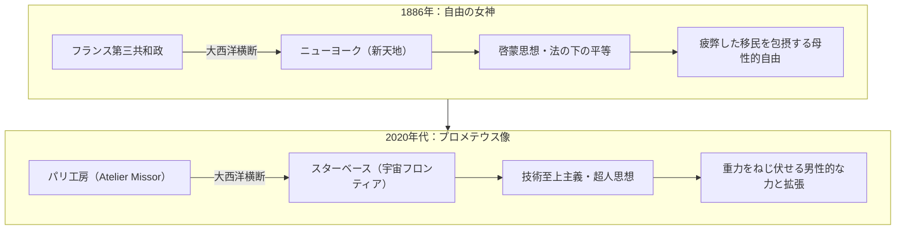

# Atelier Missorによるプロメテウス像建立とテック右派的モニュメンタリズム

> [!SUMMARY] 概要
> 本ノートは、パリの青銅鋳造工房「Atelier Missor」がSpaceXの拠点スターベースにプロメテウス像をゲリラ建立したプロジェクトを対象に、その活動実態、シリコンバレーのテック右派・加速主義（e/acc）との思想的・資本的結合、および19世紀の「自由の女神」の歴史的文脈をなぞりつつ反転させた象徴的意義を構造化した知識資産である。

---

## 主要な課題・動機

* フランスの古典彫刻工房Atelier Missorの活動実態およびその象徴的背景の把握。
* テキサス州スターベースでの巨像建立プロジェクトに見られる「テック右派（Tech-Right）」的カルチャーとの関連性の検証。
* 大西洋を越えてモニュメントを贈る行為が帯びる歴史的アナロジー（自由の女神）の解読。

## ユーザーの主要な視点・仮説

* **テック右派思想の看破**: Atelier Missorの活動スタイルや造形美に、単なる古典復興にとどまらない米国のテック右派・新反動主義の思想的兆候を直感的に察知した。
* **「自由の女神」の文脈の指摘**: フランスの工房が制作し、大西洋を渡って新世界アメリカへ火を掲げる巨像を据え付けるというプロセスが、1886年の「自由の女神（世界を照らす自由）」の歴史的構造をなぞっていることを見出した。

---

## 得られた知見・知識

### 1. プロジェクトの物質的実態とゲリラ性

Atelier Missorはパリを拠点とする古典青銅鋳造工房であり、「**新たなローマを築く**」をスローガンに英雄像や神話像を制作している。本プロジェクトは、公的な発注やSpaceXからの公式依頼によるものではなく、工房側が主導したゲリラ的な実践である。

* **制作と輸送**: パリの工房で約百日をかけて鋳造され、大西洋を横断してテキサス州スターベースへと輸送。
* **据え付けの過剰性**: 現地のクレーン会社から重量超過とリスクを理由に断られた後、自前の16トンクレーンを用いて満月の夜に強行建立された。
* **物質的実存性**: 安全管理や規格化が支配する現代社会への反措定として、圧倒的な金属の重量感と泥臭い労働を前面に押し出している。

### 2. テック右派・加速主義（e/acc）・生命主義との共鳴

表層的な職人気質とは裏腹に、米国シリコンバレーのテック右派コミュニティと深く結びついている。

* **資本的パイプ**: サンフランシスコのテック系インキュベーター「Founders, Inc.」の支援・ポートフォリオに含まれ、米テック投資家界隈で資金調達を実施。
* **出生主義（Pronatalism）の標榜**: 「**少子化を跳ね返すほど壮大なアートを作れ**」というスローガンを発信し、イーロン・マスクやシリコンバレー右派のアジェンダと共鳴。
* **古典美学（生命主義）の消費**: コーポレートアートの脱個性的・抽象的なデザイン（ウォーク的とされるもの）への反動として、ギリシャ・ローマ的な肉体美や男性性、ナポレオン的英雄主義を称揚する美学（Bronze Age派生カルチャー）を具現化。
* **技術の神話化**: 天界から火を奪い人類に技術をもたらした「プロメテウス」を象徴に掲げることで、宇宙進出や技術至上主義に神話的正当性を付与。

### 3. 「自由の女神」の再演と理念の反転

フランスからアメリカ新天地へ「火を掲げる巨像」を贈るという形式は、バルトルディの「自由の女神」を正確になぞりながら、その内実を正反対に反転させている。

| 比較項目 | 自由の女神（1886年） | プロメテウス像（Atelier Missor） |
| --- | --- | --- |
| **起点と終点** | フランス（旧世界） → ニューヨーク（新世界） | フランス（パリ） → テキサス・スターベース（宇宙開拓地） |
| **掲げられた火** | 圧政を照らす啓蒙の松明（理性の光） | 神々から奪い取った技術と文明の炎（力の象徴） |
| **造形と身体性** | ローマの自由の女神リベルタス（母性的包容） | 筋骨隆々たる男性神話巨躯（覇気・活力） |
| **思想的核心** | 近代民主主義、共和制、普遍的人道主義 | 加速主義（e/acc）、技術拡張主義、ニーチェ的英雄論 |
| **主体の性質** | 国家間の友愛に基づく公式モニュメント | テック資本と共犯関係にある私的・ゲリラ的モニュメント |

---

## 要点のまとめ

> [!NOTE]
> 1. **二重構造の実態**: Atelier Missorの活動は、伝統的な美術工芸の復興を装いつつ、実態は米国のテック右派資本や思想（e/acc、出生主義、反ウォーク）と深く同期した現代的な政治・文化現象である。
> 2. **象徴のハイジャック**: 「自由の女神」が打ち立てた大西洋横断のモニュメント形式を周到になぞりながら、啓蒙主義・平等の理念を「技術至上主義」「強者の意志」へと大胆に上書きしている。
> 3. **時代の批評性**: 安全性と効率性に閉ざされた現代社会に対し、金属の重量と神話的ナラティブを物理的に提示することで、現代のテックカルチャーが求める新しい信仰・物語の器として機能している。

---

## 関連情報・参考リンク

* [Atelier Missor 公式Xアカウント](https://x.com/AtelierMissor_)
* [Atelier Missor 公式ウェブサイト](https://ateliermissor.com)
