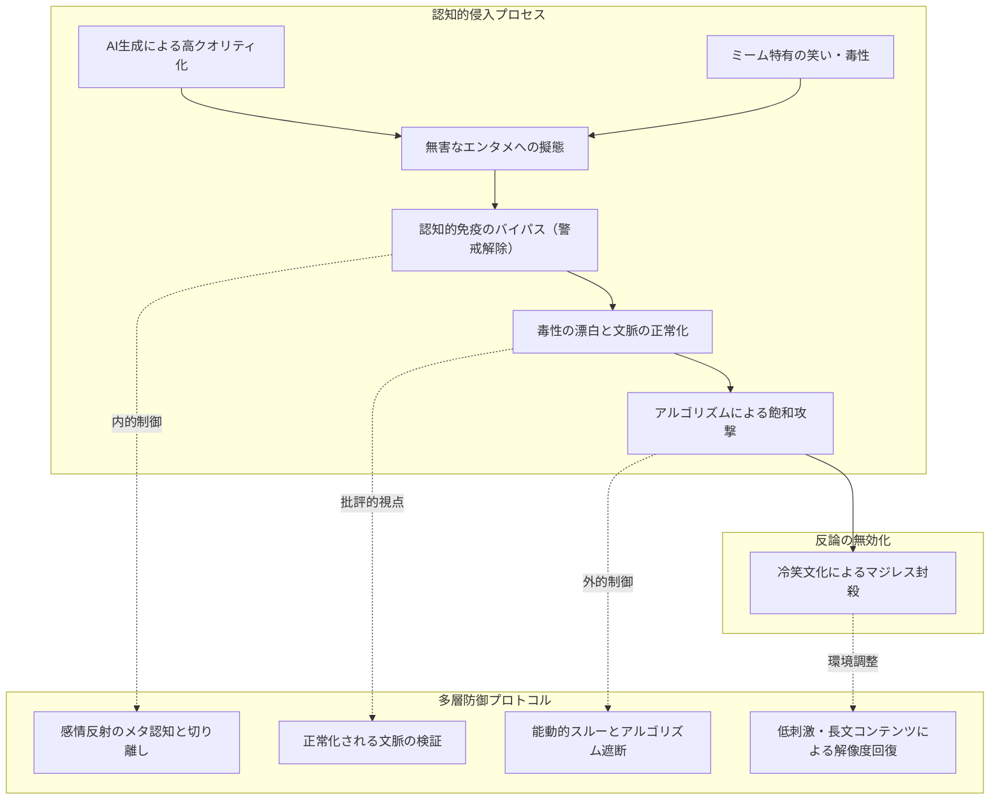

# AI生成とネットミームの融合による認知的プロパガンダの脅威と防衛策

> [!SUMMARY] 概要
> 
> 生成AIの表現力とネットミームの毒性・拡散性が合流し、「笑いとクオリティで理性を無効化する」極めて強力な認知ハック技術が成立した。本ノートでは、その侵入メカニズム（バイパス、漂白、飽和、冷笑）を深く掘り下げ、アルゴリズムと心理の二面から個人の思考の主権を守るための具体的防衛策を整理する。
> 
>   

## 主要な課題・動機

- 「**洗練された悪ノリ**」の急増：生成AIの進化により、差別や陰謀論などの有害文脈を含むアングラなミームが、一見して無害で高品質な映像・音楽・アニメへと再構築され、無自覚に消費されている問題意識。
    
      
    
- 従来のファクトチェックや倫理的批判が「**ネタへのマジレス**」として無効化される構造的課題への直面。
    
      
    
- 個人の認知や感情がアルゴリズム経由でハックされる情報空間において、実践可能で持続的な自己防衛フレームワークの構築。
    
      
    

## ユーザーの主要な視点・仮説

- AI生成技術とミームの掛け合わせは、単なるネットの流行にとどまらず、大衆の理性的判断を回避して意識を誘導する「**極めて高度で確立されたプロパガンダ手法**」であるという洞察。
    
      
    
- 生理的な笑いや感嘆の感情が発生した時点で防壁が突破されている現実を直視し、感情の反射と文脈の受容を切り離す防衛意識の必要性。
    
      
    

## 得られた知見・知識

### 1. なぜ「AI×ミーム」は最強のプロパガンダとなるのか（浸透の4段階）

#### ① 「**認知的免疫のバイパス（トロイの木馬効果）**」

従来の政治演説や思想的主張は、受け手に「説得されている」「誘導されている」という警戒心（認知的免疫）を生じさせます。しかし、ミームは「バカバカしい笑い」という無害なトロイの木馬に思想を隠蔽します。さらに生成AIの劇的な進化によって、「なぜこのネタにここまで無駄な技術力を注ぎ込んでいるのか」という技術的クオリティへの感嘆が加わります。脳が「面白い」「すごい」と快感を覚えた瞬間、警戒フィルターは完全に解除され、抵抗なく脳内へ情報が定着します。

  

#### ② 「**毒性のロンダリング（脱文脈化と漂白）**」

本来なら公の場で口にできない差別的表現、過激な政治的主張、グロテスクなアングラネタであっても、AIによってポップな楽曲、美麗なビジュアル、キャッチーな3Dアニメーションに変換されると、元の生々しい毒性が「脱文脈化」されて漂白されます。背景事情を知らない一般層は、無邪気に「耳に残る曲」「おもしろい動画」として消費し、SNSでシェアします。結果として、受け手自身が意図せぬまま、有害な言説や偏見を一般社会へ浸透させる共犯者に仕立て上げられます。

  

#### ③ 「**職人芸の民主化とアルゴリズムの飽和攻撃**」

かつて「高度に作り込まれた風刺や悪ノリ」を作るには、映像編集やDTM（音楽制作）の熟練スキルと膨大な作業時間が必要でした。生成AIはその制作コストをゼロに近づけました。これにより、特定の意図を持った陣営が、多種多様な切り口のミームを日夜大量に投下する「飽和攻撃」が可能になりました。SNSのレコメンドエンジンは「視聴維持率」「ループ回数」「コメント数」が高いコンテンツを優先的に拡散するため、脳の報酬系を刺激する高品質ミームは瞬く間にフィードを埋め尽くし、単純接触効果によって特定の世界観を人々の脳裏へ焼き付けます。

  

#### ④ 「**反論・ファクトチェックの完全無力化**」

この手法が最も厄介なのは、反撃手段が存在しない点です。まじめなジャーナリストや学者が「この表現には歴史的・倫理的な問題がある」「内容は明白な虚偽である」とファクトチェックや批判を試みても、発信側と大衆は「**ただのネタにマジレスしてどうするの？**」「**冗談も通じない堅物**」と冷笑的に切り捨てます。論理の土俵ではなく「ノリと感覚」の土俵で勝負されているため、正論をぶつければぶつけるほど批判側が滑稽に見えるという非対称性が成立しています。

  

### 2. 伝統的プロパガンダと「AI×ミーム型」の比較

|**評価項目**|**伝統的プロパガンダ**|**AI生成×ミーム型プロパガンダ**|
|---|---|---|
|**主な伝達媒体**|演説、ポスター、扇動的な記事、宣伝映画|ショート動画、パロディ楽曲、画像ミーム|
|**訴求レイヤー**|理念、義憤、危機感、大義名分|笑い、技術への感嘆、リズム、脱力感|
|**受け手の心理**|「正しいか否か」で吟味しようとする|「面白いか否か」で直感的に消費する|
|**制作・拡散コスト**|高い（組織的な資本や専門部隊が必要）|極めて低い（AIによる即時量産と大衆による自発的拡散）|
|**批判への耐性**|反論やファクトチェックで論理的に崩しやすい|冷笑（「ネタにマジレス乙」）により批判を吸収・無力化する|
|**影響の残り方**|意見や思想として記憶される|感覚、空気感、反射的な偏見として脳裏にこびりつく|

### 3. 個人の認知的自由を守るための実践的防衛プロトコル

無意識の感情反射を利用して侵入してくる情報から身を守るには、「感情の内省（内的防御）」と「接触の物理的遮断（外的防御）」の二段構えが必要です。

  

#### 内的防御：心理・メタ認知の確立

- **「快感」と「文脈」の切り離し（感情のラベリング）**
    
      
    
    生理的な笑いや「よくできている」という技術的感嘆そのものを止めることはできません。重要なのは、笑ってしまった瞬間に「**あ、今感情の防壁をハックされかけたな**」と内省のラベルを貼ることです。「面白いと感じること」と「その背後にある主張や世界観を承認すること」は全く別の事象であると認知を分離します。
    
      
    
- **「誰の何が正常化されるか」という批評的問い**
    
      
    
    面白いコンテンツに遭遇した際、「**この笑いが世間に定着した結果、誰が得をして、どんな差別や偏見が『当たり前のこと』として上書きされるのか？**」と一歩引いて観察します。パッケージの華やかさから視線をずらし、覆い隠されている意図を直視する視点が認知的抗体になります。
    
      
    

#### 外的防御：行動とアルゴリズムの制御

- **知的好奇心の能動的ブレーキ（深掘りトラップの回避）**
    
      
    
    AIミームの巧妙な罠は、「元ネタは何だろう」「誰が作ったのだろう」と探究心を刺激する点にあります。検索して関連動画を巡回し始めた瞬間、アルゴリズムはその人を「格好の標的」と判定します。「悔しいほど完成度が高いが、これ以上は追跡しない」と自ら好奇心にブレーキをかけ、タブを閉じる自制が不可欠です。
    
      
    
- **完全な無反応（スルーの徹底）**
    
      
    
    SNSのレコメンドエンジンにとって、称賛だけでなく「怒りの批判」「呆れの引用リポスト」「動画を停止して長考する滞在時間」もすべて「強いエンゲージメント」として扱われます。反論や拡散は、そのプロパガンダのリーチを自ら広げる手助けになります。不快または作為的なミームが流れてきたら、1秒も画面を止めずにスクロールし、「興味がない」を押すかキーワードを即座にミュートします。
    
      
    
- **認知的デトックス（思考の解像度とリズムの回復）**
    
      
    
    数秒単位で脳の報酬系を刺激するショート動画やSNSのタイムラインに常時浸かっていると、長期的・論理的に物事を吟味する認知的体力が著しく低下します。定期的にデジタルフィードから離れ、体系的な書籍の通読、長文の執筆、自然の中での運動など「ゆっくり思考する時間」を持つことで、感情に流されない思考の解像度を取り戻す土台を作ります。
    
      
    

## 要点のまとめ

> [!NOTE]
> 
> AI×ミームは「理性に訴えず、笑いと快感をハックして感覚を上書きする」ため、正論やファクトチェックでは防げない。自衛の要諦は、笑った瞬間にメタ認知を起動して深掘りを断ち切る「**能動的好奇心の制御**」と、アルゴリズムに一切の反応を与えない「**完全な無反応（スルー）**」を徹底することにある。
> 
>   

## 関連情報・参考リンク

特になし（チャットログからの構造化ナレッジ）